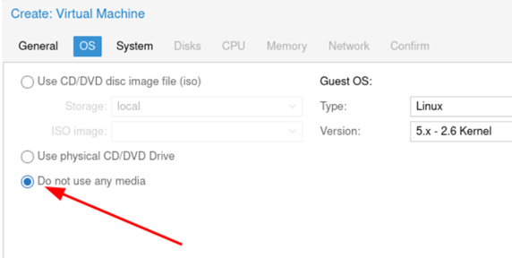
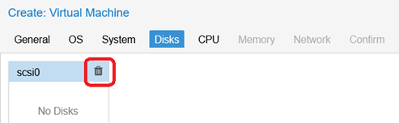
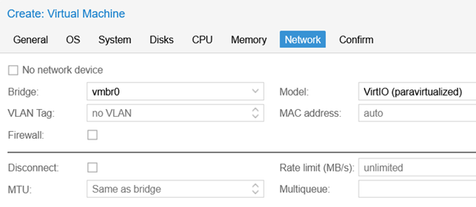

+++
title = "GNS3"
type = "default"
weight = 60
+++

Why would do this?  FortiLink trunks do not work in Proxmox due to Proxmox developers have reserved the use of VLANs 0 and 4095 (need to find link defintively describin this).

There are "how-to" posts that I could not make FortiLink work in Proxmox: (examples below)
- [global channels](https://teams.microsoft.com/l/message/19:104c76bd09954d5794f64ac25e5b6e86@thread.skype/1720003124774?tenantId=2c36c478-3d00-452f-8535-48396f5f01f0&groupId=62fd9f66-e24c-403e-81bc-d8dfd7bf0ea8&parentMessageId=1720003124774&teamName=FortiChat%20Global%20Channels&channelName=swat_fap_fsw_fex_switch_access&createdTime=1720003124774)
- [Support Forum](https://forum.proxmox.com/threads/unable-to-create-sdn-vnet-without-tag.148566/)

### **Verify Nested Virtualization is Enabled** 
- https://pve.proxmox.com/wiki/Nested_Virtualization
- https://devopstales.github.io/virtualization/install-vmware-in-proxmox/
    - At CLI:	cat /sys/module/kvm_intel/parameters/nested
        - If it returns “Y”, proceed to Creation Step
        - If it returns “N”, follow steps in URL above to enable

### **GNS3 VM Creation**
- {}
- Download [GNS3 VMware ESXi VM OVA](https://gns3.com/software/download-vm)

````bash
sudo apt install unzip -y

mkdir GNS3          <= (make directory to unzip OVA)

cd GNS3

curl -O https://github.com/GNS3/gns3-gui/releases/download/v2.2.57/GNS3.VM.VMware.ESXI.2.2.57.zip

unzip *.zip

tar -xvf *.ova
````
{}
- In PVE GUI  > Click "Create VM"
    - __General__
        -	Choose Node
        -	Choose VM_id (or use the default)
        -	Type VM Name
    - __OS__
        -	Do not use any media
        
    - __System__
        -	Accept Defaults
        -   **Graphic card:** Default
        -	**Machine:** Default
        -	**BIOS:** Default
        -	**SCSI Controller:** VirtIO SCSI                
    - __Disks__
        -	Click on Trashcan Icon and delete disk
        
    - __CPU__
        -	**Cores:** 4
        -	**Type:** host
    -  __Memory__
        -	16GB is minimum
    - __Network__
        -	**Bridge** vmbr0
        -   Untick Firewall
        
    - __Confirm__
        -	Click **Finish**

Wait for the VM Create process to complete (i.e. Status OK)
- {}
- Import the VMDK disks into VM just created
    - Make sure machine ID (511 is my GNS3 VM) and VMDK file name matches VM name before running the commands below.
    - **Note** - These commands take time to run as they are converting from VMDK formate to qcow2
````bash
qm importdisk <VMid you choose> <VM name you choose>_VM-disk1.vmdk <your Proxmox image storage> -format qcow2

qm importdisk <VMid you choose> <VM name you choose>_VM-disk2.vmdk <your Proxmox image storage> -format qcow2
````
{}


### **Start ESXi VM**
-	Reduce size of system partition ({}Important{} **MUST BE DONE AT INITIAL INSTALL**)
    - Background:
        - ESXi 7.0 introduced a system-storage boot media layout designed to ensure new features and capabilities could be added in future releases. The partition layout can consume up to 138GB of disk space, significantly limiting usable space to create a VMFS datastore on small server with finite hardware resources.
    - Documentation:
        - https://williamlam.com/2020/05/changing-the-default-size-of-the-esx-osdata-volume-in-esxi-7-0.html
    - "How-To" reduce system partition size:
        - Start host with install image
        - When ESXi installer window appears
        - Press Shift+O within 5 seconds to edit the boot options.
        - Add the following to the end of the prompt:
            - systemMediaSize=min

### **Post install MUST DO'S**
- Assign a License in DCUI 
    - Click on: Host/Manage/Licensing/Assign License
-	Enable SSH
    - Click on: Host / Actions / Services / Enable Secure Shell (SSH)
- Enable SSH on boot:  
    - Click on: Host/Manage/Services/Right click TSM-SSH/Policy/Select "Start and stop with host" 
- Configure DCUI
    - Click on: Host/Manage/System/Advanced Settings
        - UserVars.DcuiTimeOut Value=0
        - UserVars.HostClientSessionTimeout Value=0
-	Edit NTP Settings
    - Click on: Host/Manage/System/Time & date
    - Enable NTP client/Start and stop with host/208.91.112.63  	<=ntp1.fortiguard.com
