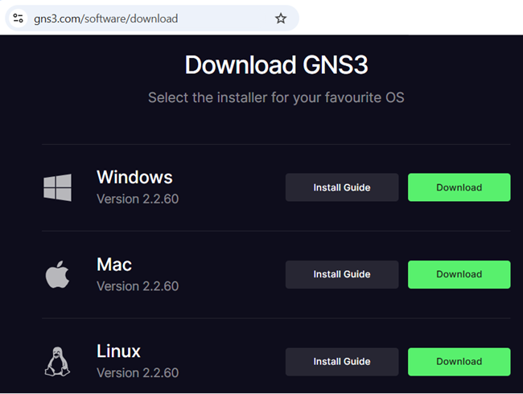
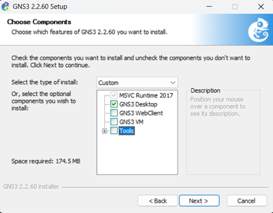
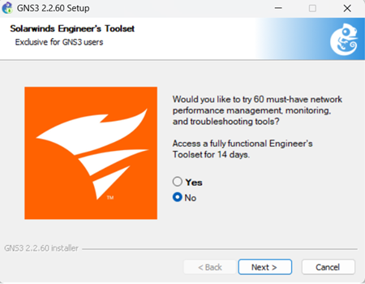
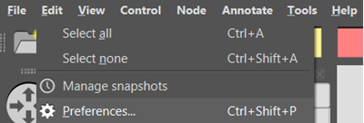
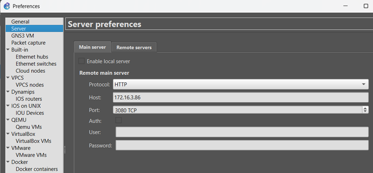

+++
title = "GNS3"
type = "default"
weight = 60
+++

### **Verify Nested Virtualization is Enabled** 
{}
````bash
cat /sys/module/kvm_intel/parameters/nested
````
- If it returns “Y”, proceed to [**GNS3 VM Creation**](/extras/gns3/#gns3-vm-creation) step
- If it returns “N”, follow steps in URL below to enable
    - https://pve.proxmox.com/wiki/Nested_Virtualization
    - https://devopstales.github.io/virtualization/install-vmware-in-proxmox/

{}


### **Create GNS3 VM**
- If you get the error {}No route to host{} with any of the following steps, use the **[Troubleshoot Ansible](/Extras/Troubleshoot_Ansible)** steps

{}
- from Terminal in OOB
````bash
cd /home/fortinet/automation/ansible/ubuntu
````
````bash
./create_ubuntu_vm.sh      ../vars/all-hosts.yml  <PVE server name>  gns3
````
````bash
./start_stop_remove_vm.sh  ../vars/all-hosts.yml  <PVE server name>  gns3 started
````
{}

### **Configure GNS3 VM**
{}
- Make sure GNS3 VM has fully started (GUI is up and running) before exeucting the following.
    - Suggest opening GNS3's console window on PVE to verify before continuing.
````bash
./wallpaper_update.sh  gns3
````
````bash
./configure_gns3.sh   gns3
````
{}

{}
- From the GNS3 VM's terminal execute the script below
- When prompted whether non-root users should be allowed to use wireshark and ubridge, select **‘Yes’** both times
````bash
cd /home/fortinet/Downloads
````
````bash
GNS3_Install.sh
````
- VM will reboot when finished
{}

### **Install GNS3 GUI on Laptop**
{}
- Login to GNS3
    - https://www.gns3.com/account/login
- Download GNS3
    - [https://www.gns3.com/software/download](https://www.gns3.com/software/download)
    
{}
{}
- Uncheck all options but **MSVC Runtime 2017** and **GNS3 Desktop**
    
- "No" to Solarwinds Engineer's Toolset
    
{}
{}
- Select "Edit/Preferences"
    
- Select "Server"/"Main server"
    
{}

