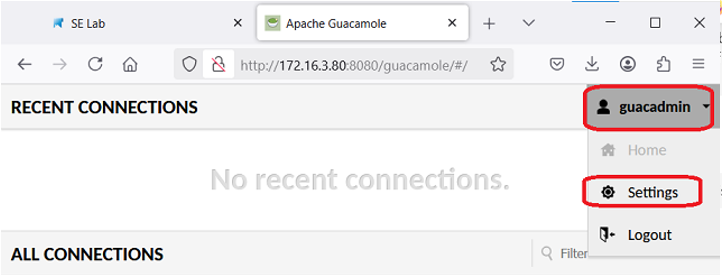
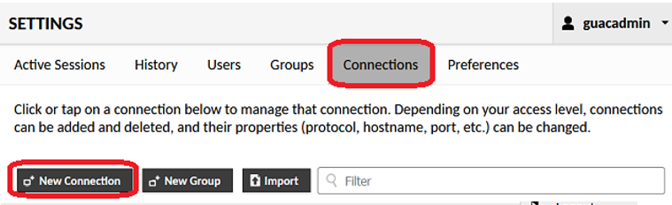
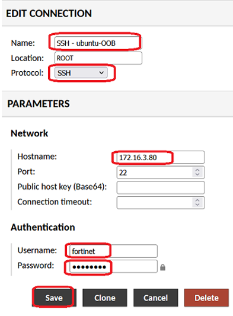
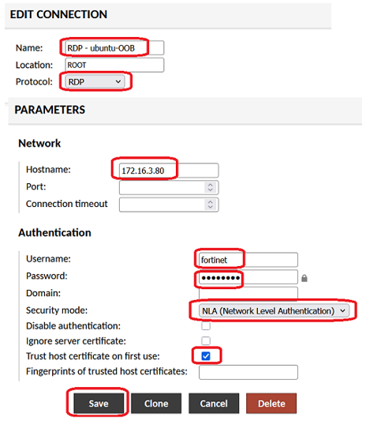
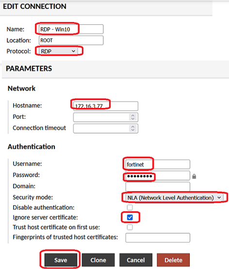
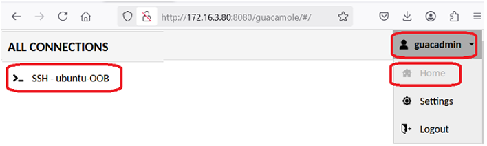
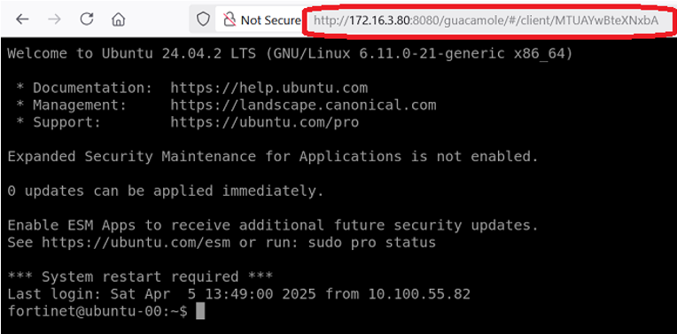
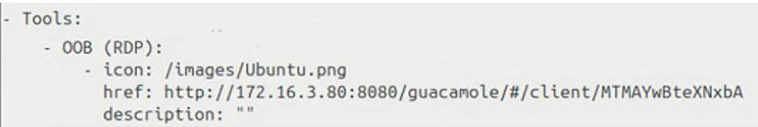
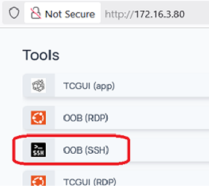

+++
title = "Guacamole"
type = "default"
weight = 30
+++

### Change/Add/Delete Guacamole Connections
Open browswer and login to `http://172.16.3.80:8080/guacamole`
- **User/Password:** guacadmin / guacadmin
- Click on **Settings**
 
- Click on **Connections**
 
- Configure SSH	
 
- Configure RDP (for Ubuntu)
 
- Configure RDP (for Windows)

### Add Guacamole URL’s to homepage
- Launch a connection from guacadmin / Home
 
- Copy the URL
   
- Add to homepage’s bookmark.yaml file **/home/fortinet/c_data/homepage/config/bookmarks.yml**
 
- From the homepage click on the link
 

### Source/Details
- [Create](https://guacamole.apache.org/doc/gug/jdbc-auth.html#creating-the-guacamole-database) the Guacamole database
- [Create a user](https://guacamole.apache.org/doc/gug/jdbc-auth.html#granting-guacamole-access-to-the-database) for Guacamole database
- Configure [connection settings](https://guacamole.apache.org/doc/gug/administration.html)
- [MySQL dump and restore](https://dev.mysql.com/doc/refman/8.0/en/using-mysqldump.html) 