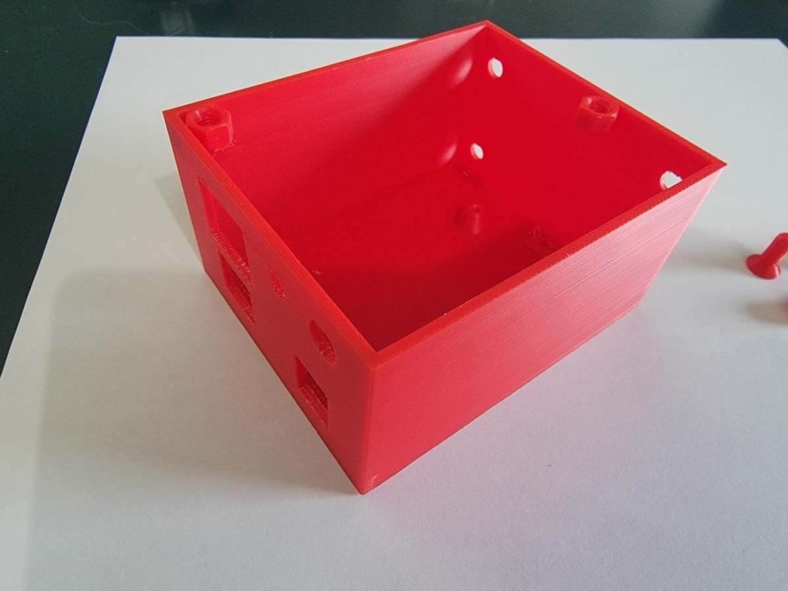
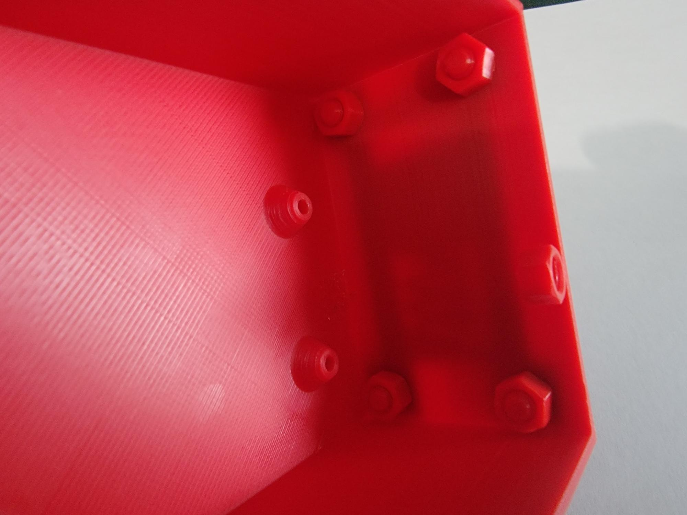
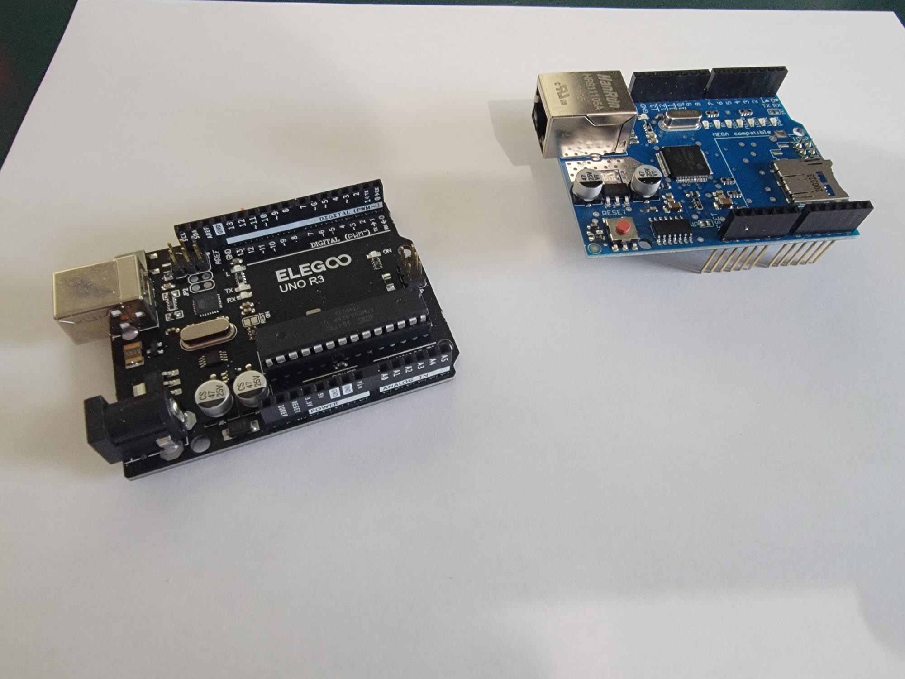
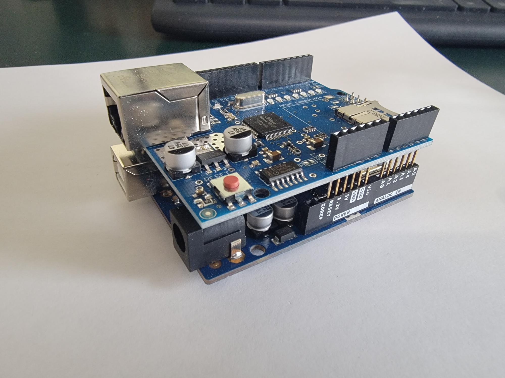
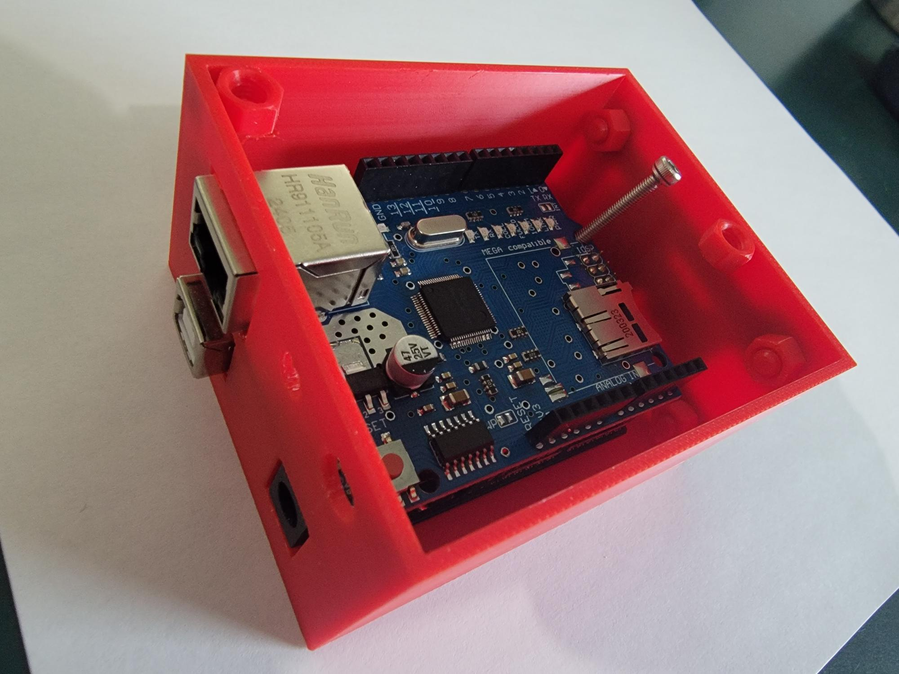
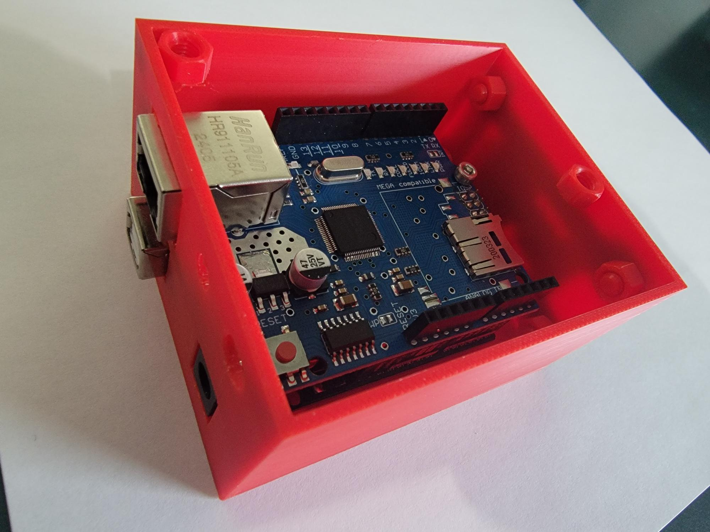
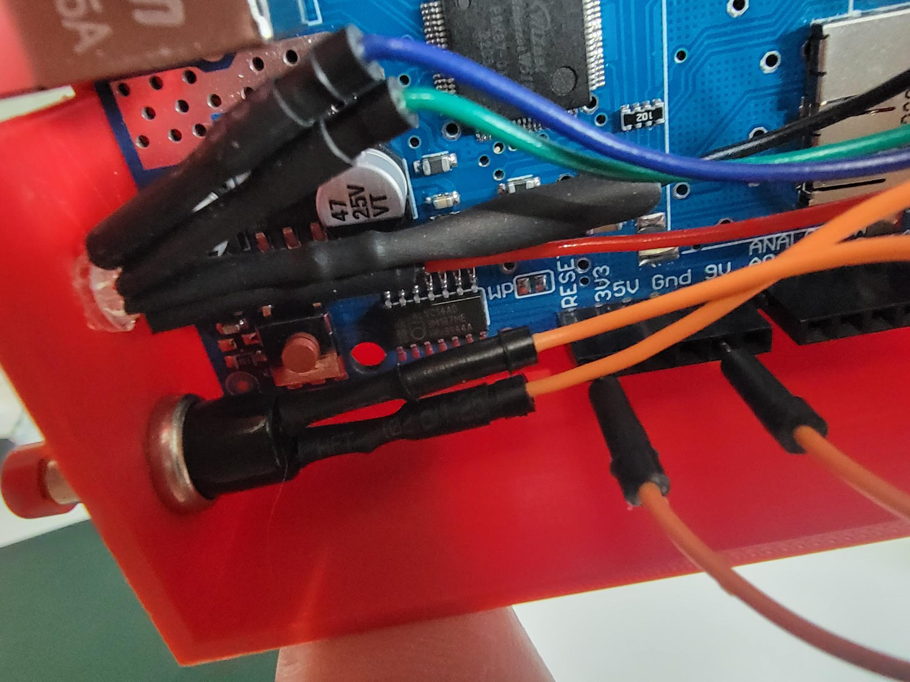
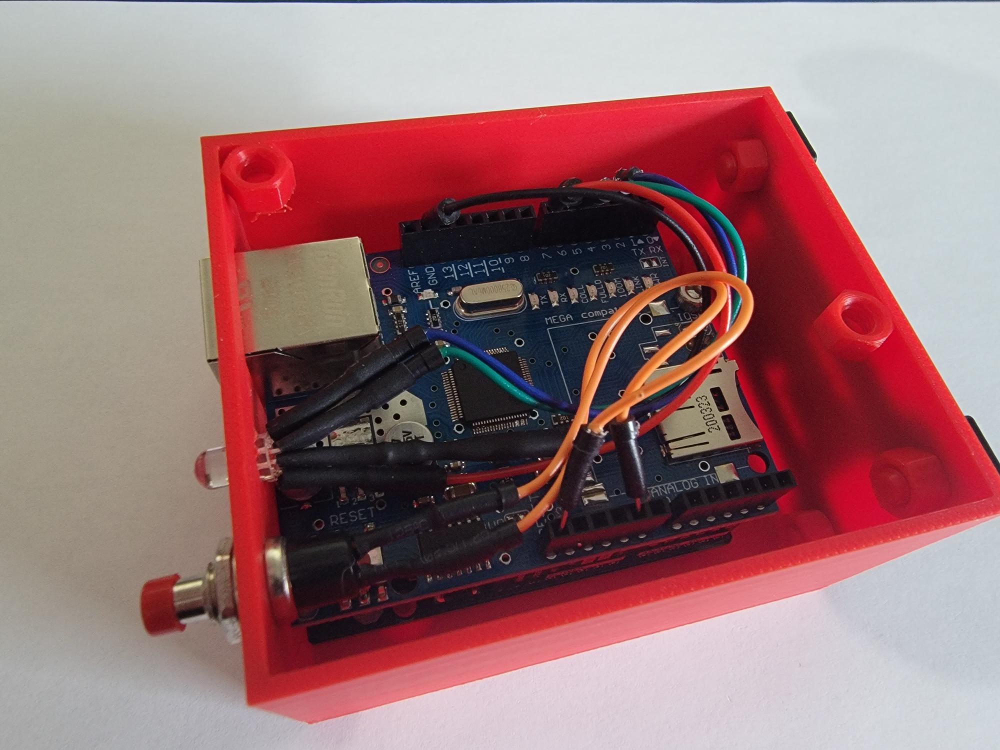

+++
title = "How-To Build Modbus Devices"
type = "default"
weight = 40
+++

**Arduino Modbus Sketches:**

{{% button href="https://github.com/stevesweeneywisc/SE-Lab-Build/raw/refs/heads/main/content/Extras/OT%20Demo%20Lab/How_To_Build_Modbus_Devices/Ethernet_Modbus_TCP_Server_LED.ino" style="tip" icon="angle-down" %}}Ethernet_Modbus_TCP_Server_LED.ino{} 
 
{{% button href="https://github.com/stevesweeneywisc/SE-Lab-Build/raw/refs/heads/main/content/Extras/OT%20Demo%20Lab/How_To_Build_Modbus_Devices/Ethernet_Modbus_TCP_Client_Toggle.ino" style="tip" icon="angle-down" %}}Ethernet_Modbus_TCP_Client_Toggle.ino{} 

**3D Printed Parts 3mf File:**

{{% button href="https://github.com/stevesweeneywisc/SE-Lab-Build/raw/refs/heads/main/content/Extras/OT%20Demo%20Lab/How_To_Build_Modbus_Devices/Uno_Ethernet_Enclosure-Box.3mf" style="tip" icon="angle-down" %}}Uno_Ethernet_Enclosure-Box.3mf{}

### **3D Printed Parts**

### **Attach DIN Rail Mount**

### **Attach Ethernet Hat to Arduino UNO**

### **Insert Arduino UNO with Ethernet Hat**

### **Wire Push Button and LED**

