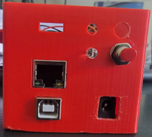
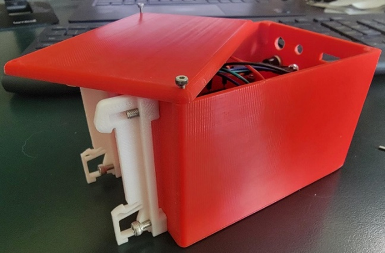
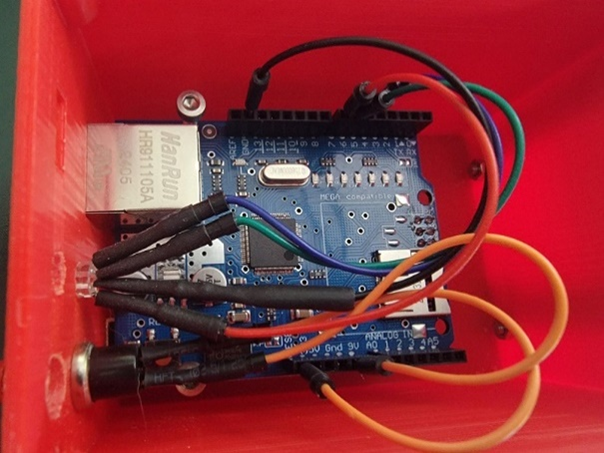

+++
title = "How-To Build Modbus Devices"
type = "default"
weight = 40
+++

Arduino Modbus Sketches:
-  {{% button href="https://github.com/stevesweeneywisc/SE-Lab-Build/raw/refs/heads/main/content/Extras/OT%20Demo%20Lab/How_To_Build_Modbus_Devices/Ethernet_Modbus_TCP_Server_LED.ino" style="tip" icon="angle-down" %}}Ethernet_Modbus_TCP_Server_LED.ino{}
- {{% button href="https://github.com/stevesweeneywisc/SE-Lab-Build/raw/refs/heads/main/content/Extras/OT%20Demo%20Lab/How_To_Build_Modbus_Devices/Ethernet_Modbus_TCP_Client_Toggle.ino" style="tip" icon="angle-down" %}}Ethernet_Modbus_TCP_Client_Toggle.ino{}

### **Modbus 3D Printed Case**

### **Arduino LED and Button Wiring**

