+++
title = "Configs"
type = "default"
weight =20
+++
 
### **FGR Configs**

- Microsegmentation with Modbus Traffic
    - {}FortiGate Rugged Config - Modbus{} 
    - Change FSW port mode to NAC
    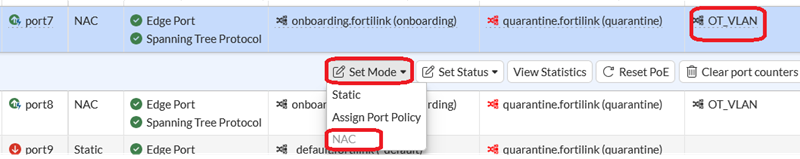

- Digital I/O
    -  {}FortiGate Rugged Config - Digital I/O{} 

- FAP
    - {}FortiGate Rugged Config - Wireless{} 

### **How-To Program Arduino Modbus Devices**

- Step-by-step guide to installing the Arduino IDE, loading OT sketches, and uploading Modbus TCP firmware to the Arduino Uno WiFi Rev2."

**Arduino Modbus Sketches:**

- Server (with LED)
    - {}Ethernet_Modbus_TCP_Server_LED.ino{} 
 - Client (without LED)
    - {}Ethernet_Modbus_TCP_Client_Toggle.ino{}  

---

### Prerequisites

Before starting, ensure you have the following:

- A computer running Windows 10/11 with internet access and local administrator privileges
- An Arduino Uno WiFi Rev2 board
- A USB Type-A to Type-B cable
- Access to the lab network (Ethernet switch with available port)

{}
Do not power the Arduino via both Power-over-Ethernet (PoE) and USB simultaneously. Use one power source at a time to avoid hardware damage.
{}

---

### Install the Arduino IDE

Download the Arduino IDE from **<https://www.arduino.cc/en/software/>** and run the installer.

---

### Install Board Support Package

The Arduino Uno WiFi Rev2 requires a separate board package. After installing the IDE:

- Open the **Boards Manager** from the left sidebar
- Search for `megaAVR`
- Locate **Arduino megaAVR Boards** by Arduino and click **Install**

[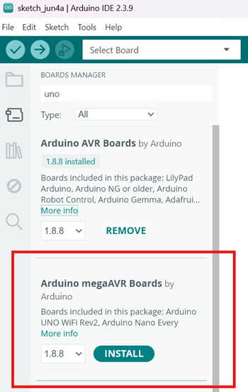](boards-manager.png)

{}
After installation the package status will show `INSTALLED`. {}

---

### Open the OT Sketch Files

Open the sketch files from this page. When prompted to move the file into a sketch folder, click **OK**.

[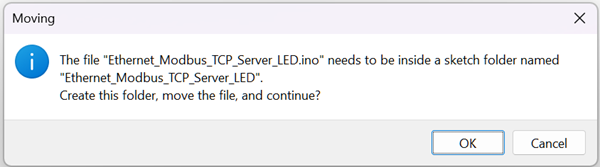](moving-dialog.png)

{}
There is a known bug in Arduino IDE 2.x where a sketch may not appear in the Sketchbook after opening. To fix this, click the three-dot menu (**⋯**) on the sketch tab and select **Rename**.
{}

[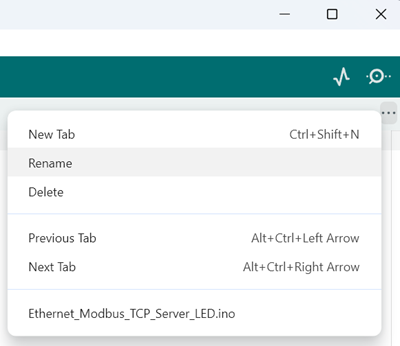](rename-menu.png)

- Save the file (**Ctrl+S**) to the default Arduino documents directory
- Both sketches should now appear under **OT Files** in the Sketchbook

[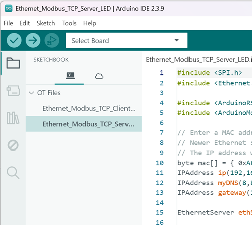](sketchbook.png)

- Repeat for both the Client and Server sketch files

---

### Connect the Arduino

Plug the Arduino into your workstation via USB. The IDE should auto-detect the board and assign a COM port.

- If not detected automatically, click **Select Board** in the toolbar and choose **Arduino Uno WiFi Rev2**

[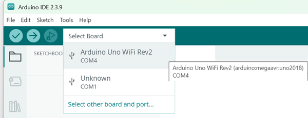](board-select.png)

{}
Do not connect PoE and USB power simultaneously — use only one power source at a time.
{}

---

### Install Required Libraries

The OT sketches depend on two libraries. Install them via the Library Manager:

- Click the **Library Manager** icon in the left sidebar (or go to **Tools → Manage Libraries**)
- Search for `ArduinoModbus` and click **Install**
- When the dependency dialog appears, click **Install All**

[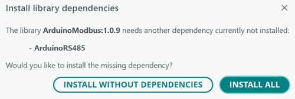](install-all.png)

[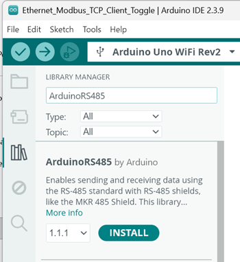](library-rs485.png)

{}
Always choose **Install All**. Installing ArduinoModbus without ArduinoRS485 will cause compilation errors.
{}

---

### Upload the Sketches

Each sketch must be uploaded to a separate Arduino board — one for the Server (with LED), one for the Client (without LED).

- Open the **Server** sketch (`Ethernet_Modbus_TCP_Server_LED`) from the Sketchbook
- Confirm the correct board and port are selected in the toolbar
- Click the **Upload** button (→ arrow icon)

[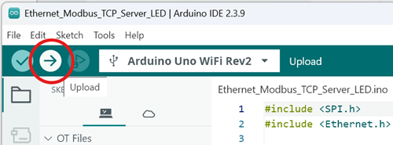](upload-button.png)

- Wait for the output console to display `Done uploading`
- Disconnect the first Arduino, connect the second, and repeat for the **Client** sketch (`Ethernet_Modbus_TCP_Client_Toggle`)

{}
If compilation errors appear, verify that **ArduinoModbus** and **ArduinoRS485** are both installed and the correct board is selected.
{}

---

### Checklist

Verify all steps are complete before beginning the lab exercise:

- [ ] Arduino IDE installed
- [ ] Arduino megaAVR Boards package installed via Boards Manager
- [ ] Server sketch (`Ethernet_Modbus_TCP_Server_LED`) opened and saved
- [ ] Client sketch (`Ethernet_Modbus_TCP_Client_Toggle`) opened and saved
- [ ] Sketchbook visibility bug resolved (Rename → Save) for both sketches
- [ ] Arduino connected via USB; board and port confirmed in toolbar
- [ ] ArduinoModbus and ArduinoRS485 libraries installed (Install All)
- [ ] Server sketch uploaded to first Arduino board
- [ ] Client sketch uploaded to second Arduino board

---

### **Arduino Troubleshooting Using the Serial Monitor**

The Serial Monitor provides real-time terminal output from the connected Arduino, making it the primary tool for diagnosing connection and communication issues at runtime.
{}
Do not power the Arduino via both Power-over-Ethernet (PoE) and USB simultaneously. Use one power source at a time to avoid hardware damage.
{}

### Opening the Serial Monitor

1. Ensure the Arduino is connected via USB **and the POE Power is NOT connected** and the correct board and port are selected 
2. Click the **Serial Monitor icon** (magnifying glass) in the top-right corner of the IDE toolbar.

[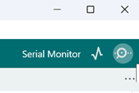](serial-monitor-icon.png)

3. The Serial Monitor panel will open at the bottom of the IDE window.
4. Confirm the baud rate is set to **9600 baud** (bottom-right of the Serial Monitor panel).

### Reading Serial Output

The Serial Monitor displays live text output from the Arduino sketch. Use this to verify connectivity and diagnose Modbus communication errors.

[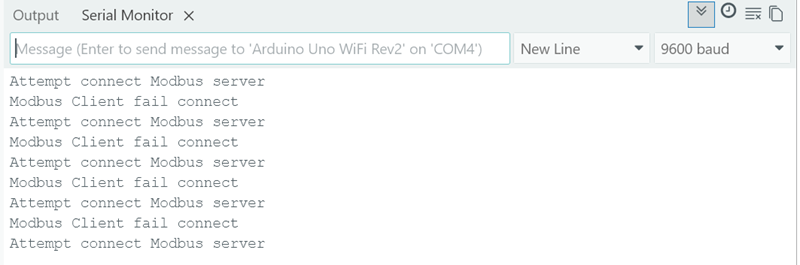](serial-monitor-output.png)

*Serial Monitor output showing repeated Modbus client connection failures. This indicates the client cannot reach the server — check Ethernet cabling and IP configuration.*

{}
The Serial Monitor is only active while the Arduino is connected via USB. Once you disconnect USB and power the device via PoE, serial output is no longer available.
{}
