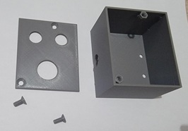
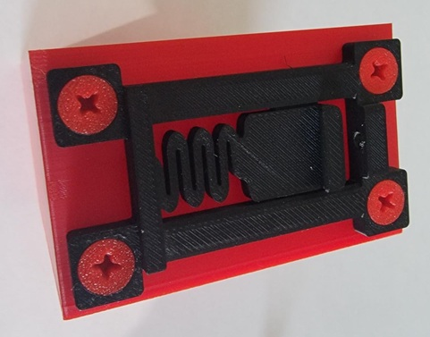
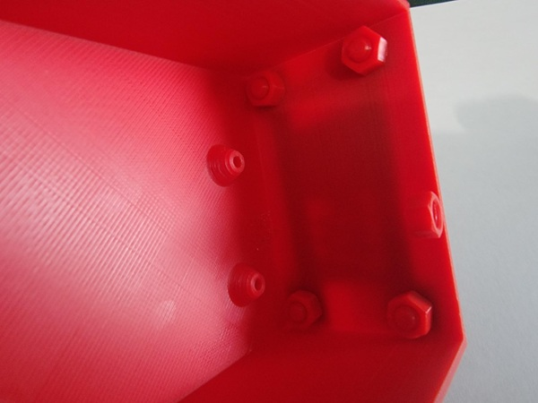
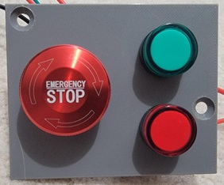
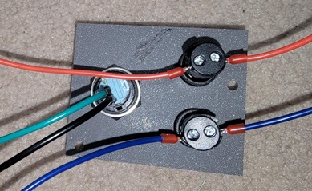
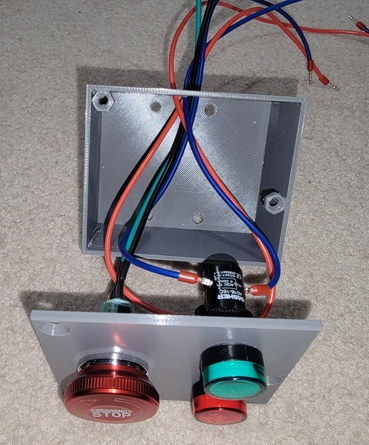
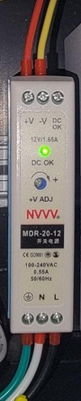
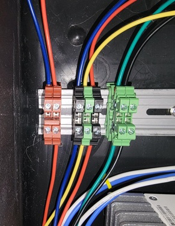
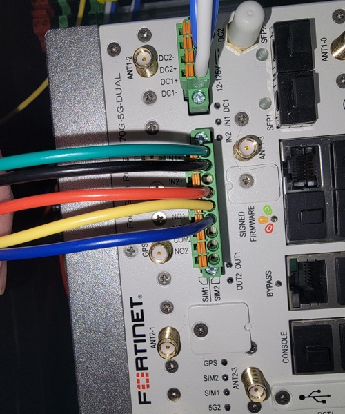
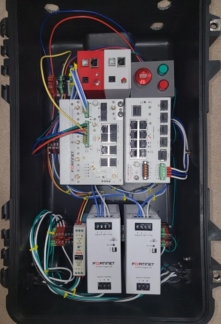

+++
title = "How-To Digital I/O"
type = "default"
weight = 50
+++

**3D Printed Parts 3mf File:**

{}Uno_Ethernet_Enclosure-Box.3mf{}

### **3D Printed Parts**

- Use ONLY small pen screwdriver on bolts (Don't Over Tighten)

### **Digital I/O Components**
**Latching Emergency Stop Button**

**16mm Indicator Lights**

### **Attach DIN Rail Mount**

- Attach with nuts on back side (Don't Over Tighten)

### **Insert Digital I/O Components into Lid**

### **Insert Wires into Digital I/O LEDs**

### **Insert Digital I/O into Box with Wires out Egress Hole**

### **Wiring Schematic - Overview for this lab**

### **12 VDC Power Supply**

### **Terminal Blocks**

### **Digital I/O Wires into FGR**

### **Final Assembly**

