+++
title = "How-To Digital I/O"
type = "default"
weight = 50
+++

### **Digital I/O Components**

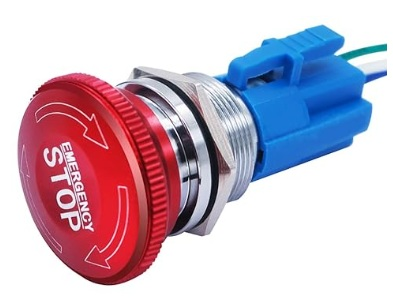

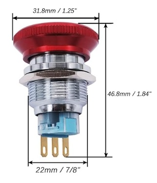

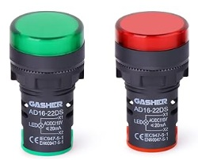

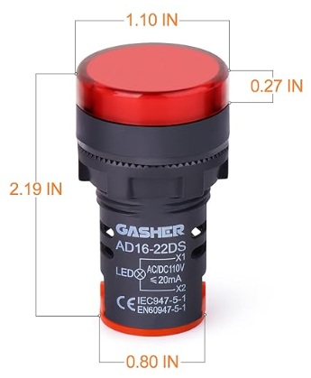

### **Create Holes in Encloser**

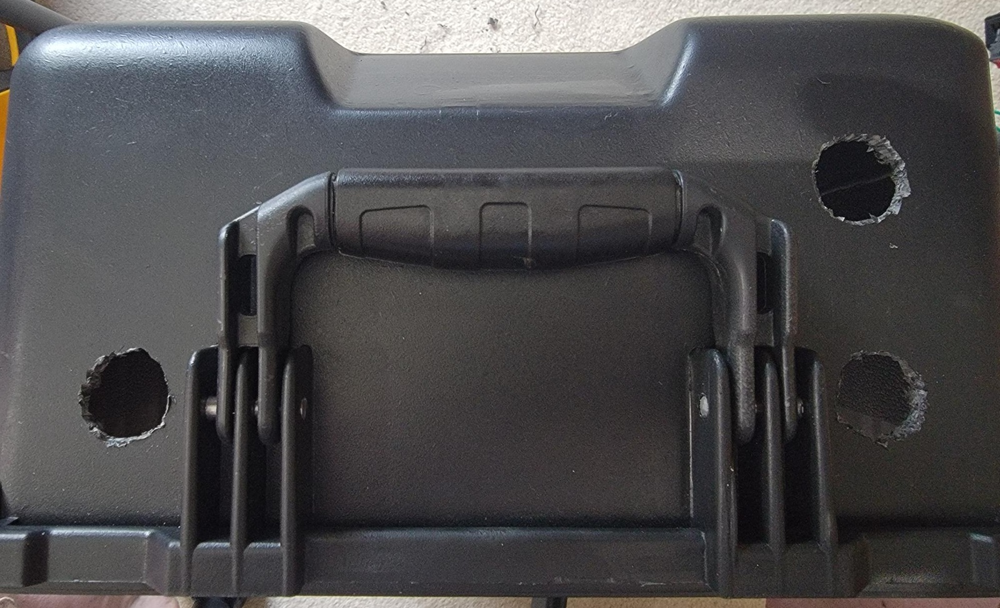

### **Mount Components**

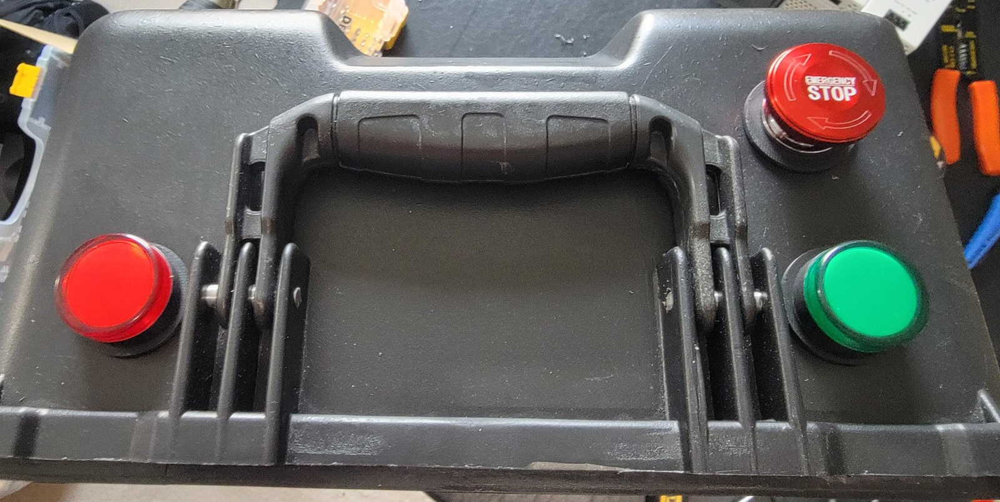

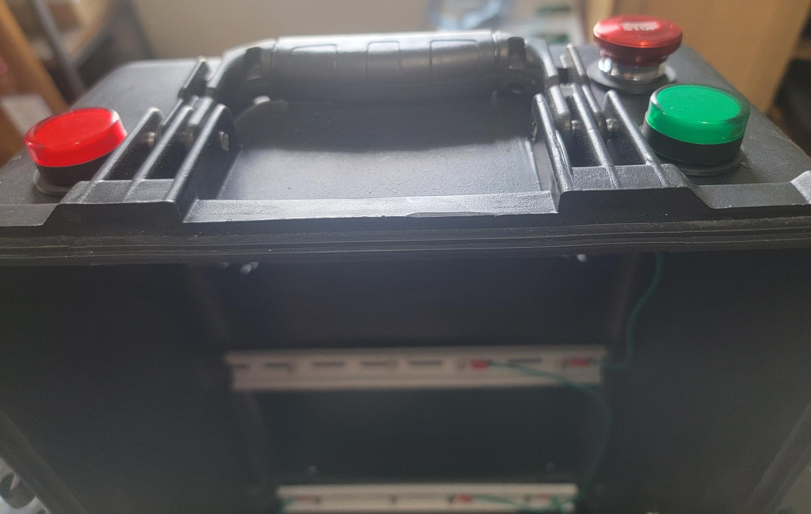

### **Wiring Schematic - Input (Button)**

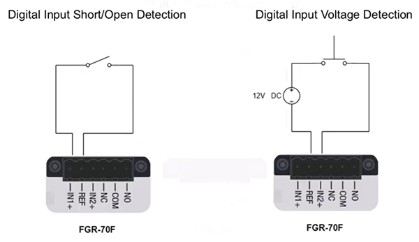

### **Wiring Schematic - Output (LEDs)**

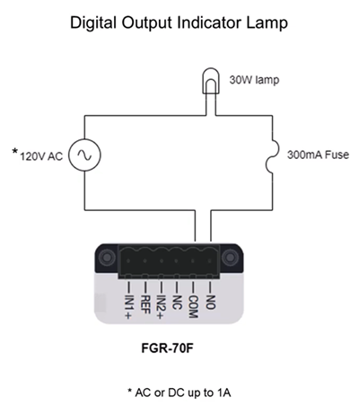

### **Wiring Schematic - Overview for this lab**

 {}This wiring schematic shows a 24VDC.  The Fortinet Power Supply is 48VDC only, thus a seperate Power Supply is REQUIRED.  The 12VDC listed in the BOM is the suggested Power Supply{}

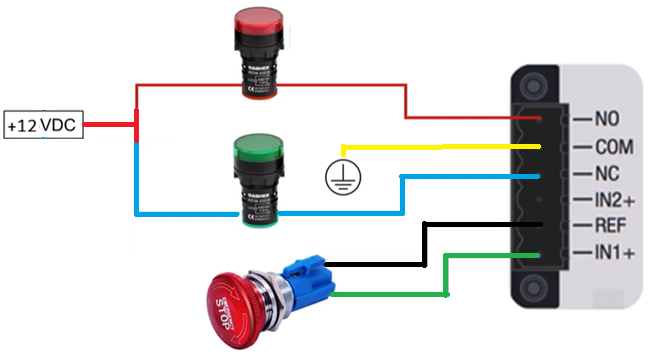

### **Final Assembly**

{}In the picture below a 24VDC power supply is "sandwiched" between the two Fortinet Power Supplies. The 12VDC listed in the BOM is the suggested Power Supply{}

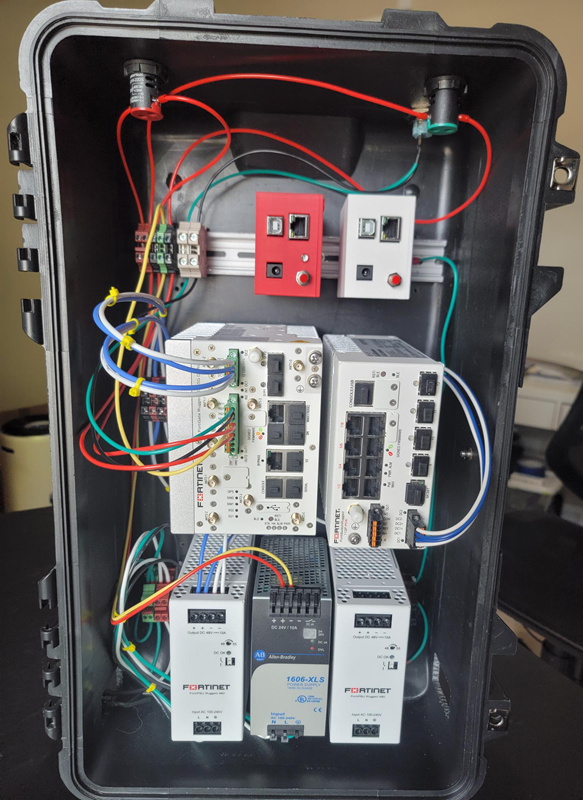