+++
title = "How-To Build Enclosure"
type = "default"
weight = 30
+++

### **Enclosure Build Steps**
**Enclosure Prep**

**Remove Lid**
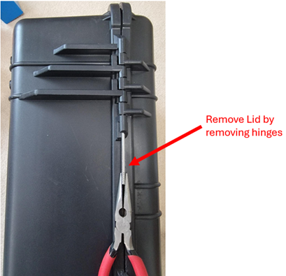

**Remove Pick-and-Pull Foam Insert**
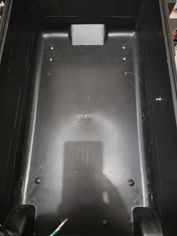

### **Mount DIN Rails**
**Remove Back of Enclosure**
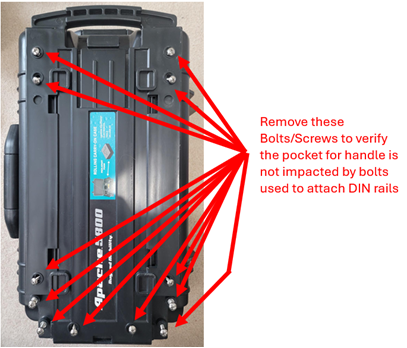

**Cut DIN Rails to length**
- Use 1/8” drill bit to make 4 evenly spaced holes for bolts
- Secure with M4x16 bolts
- DIN rail needs to be "just above" or "just below" nubs as it MUST sit flat
- Drill holes from Inside case

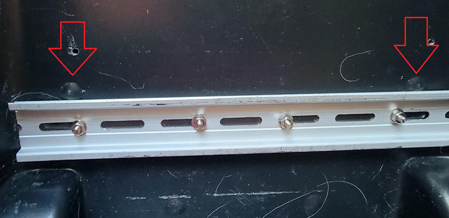

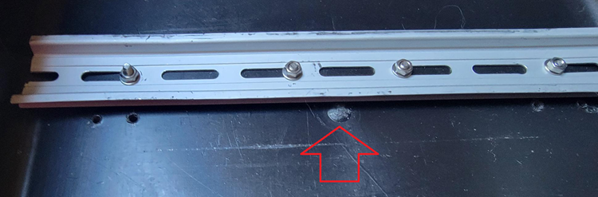

**Inside View**
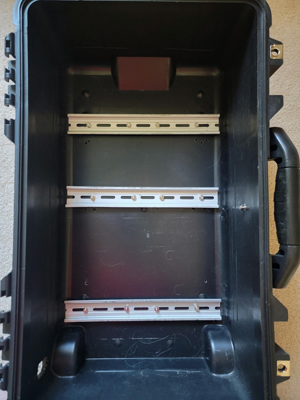

**Backside View**
- Use 5/16" drill bit BY HAND (don't use drill) to create countersink
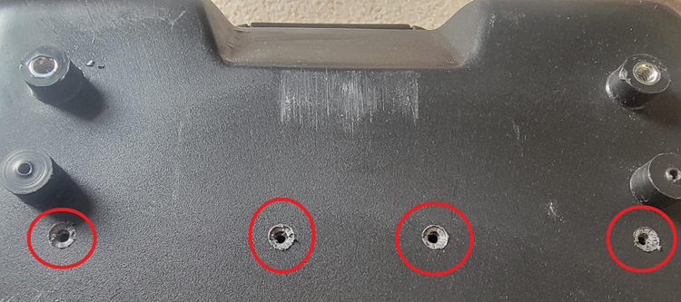

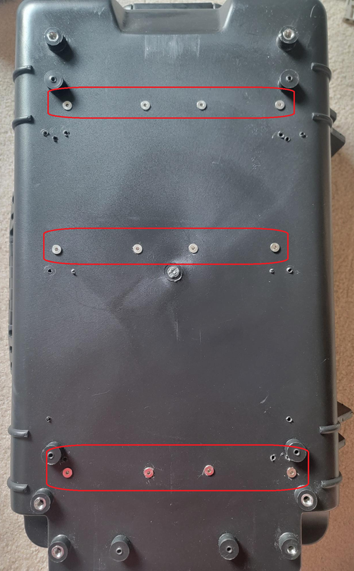

- Put flat washer and nut on each bolt (except the end one) and tighten
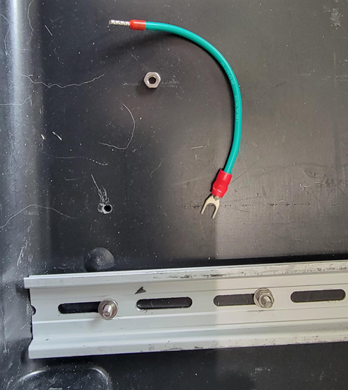

- Create Ground Wire daisy chain between each rail as show below
- Use fork connectors and attach between washer and nut on the end bolt
- The last rail will be connected to Ground Terminal Block (it will use ferrule connector)
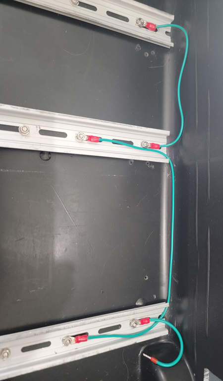

### **Wall Power Adapter**
**Make Hole to Fit Adapter**
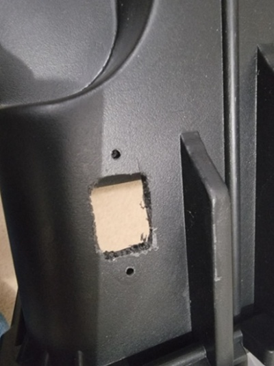

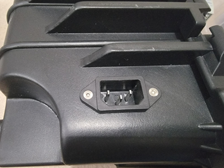

### **Wiring Wall Power Adapter**
- Solder Wires to 3-Prong Adapter
- Use standard colors for US single-phase AC:
   - Line/Black
   - Neutral/White
   - Earth-Ground/Green
- Use shrink tubing to cover soldered connections
- Cut wires to length for inserting/affixing to DIN Rail Terminal Blocks 
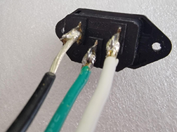

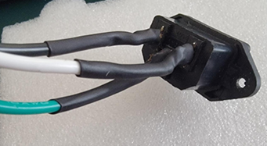

### **Wiring Wall Power Adapter to AC Terminal Blocks**
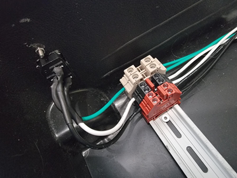

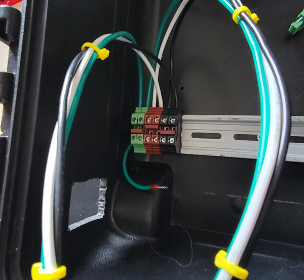

### **Wiring AC Terminal Blocks to DC Power Supplies**
- Use standard colors for US single-phase AC:
   - Line/Black
   - Neutral/White
   - Earth-Ground/Green
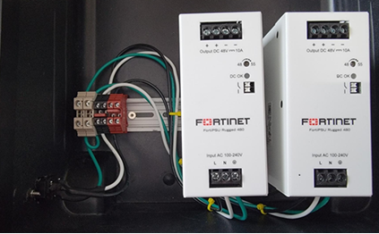

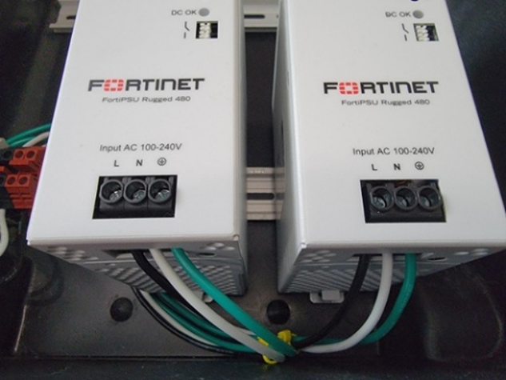

### **Wiring DC Power Supplies to DC Terminal Blocks**
- Suggested 48VDC colors:
   - V+ == Blue
   - V- == White
- If using dual power supplies, do this step twice (once for each Power Supply)
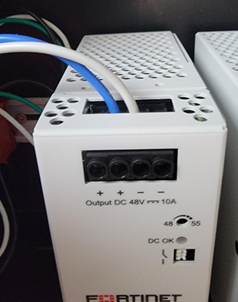

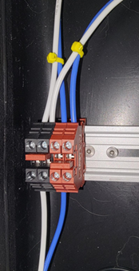

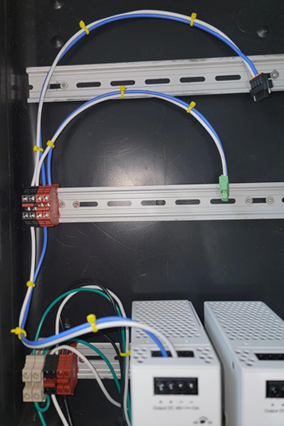

### **Mount and Wire = FGR and FSR**

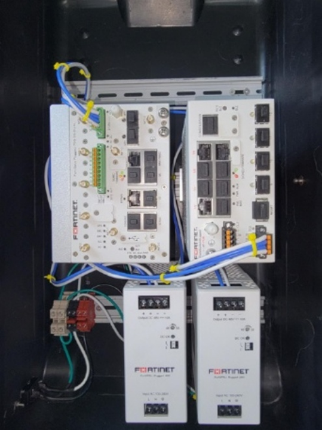

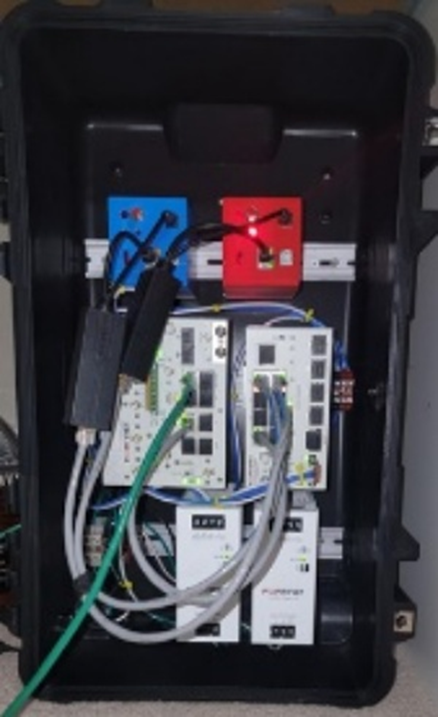

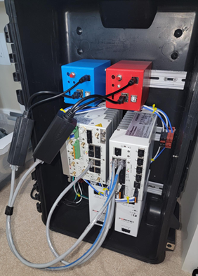
