+++
title = "How-To Build Enclosure"
type = "default"
weight = 30
+++

### **Enclosure Build Steps**
**Enclosure Prep**

**Remove Lid**

**Remove Pick-and-Pull Foam Insert**

### **Mount DIN Rails**
**Remove Back of Enclosure**

**Cut DIN Rails to length**
- Use 1/8” drill bit to make 4 evenly spaced holes for bolts
- Secure with M4x16 bolts
- Drill holes from Inside case

- Bottom DIN rail (Power Supply Rail) needs to be "just below" nubs as seen below

- Middle DIN rail (FGR/FSR Rail) needs to be "just above" nubs as seen below

- Top DIN rail (Modbus/Digital I/O Rail) needs to be "just below" nubs as seen below

**Backside View**
- Use 5/16" drill bit BY HAND (don't use drill) to create countersink

- Put flat washer and nut on each bolt (except the end one) and tighten

- Create Ground Wire daisy chain between each rail as show below
- The last rail will be connected to Ground Terminal Block (it will use ferrule connector)

### **Wall Power Adapter**
**Make Hole to Fit Adapter**
- Use Hole Template
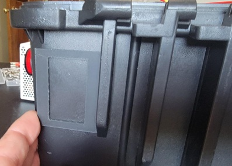

- Create Hole
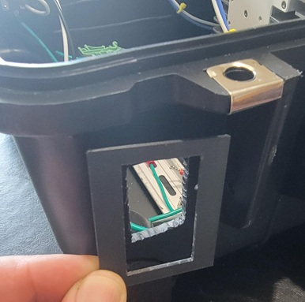

- Fit Power Plug into Hole 
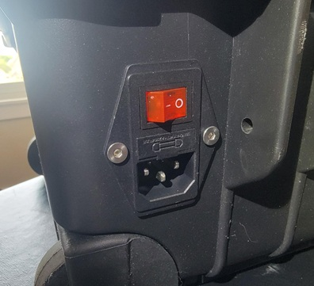

### **Wiring Topology**
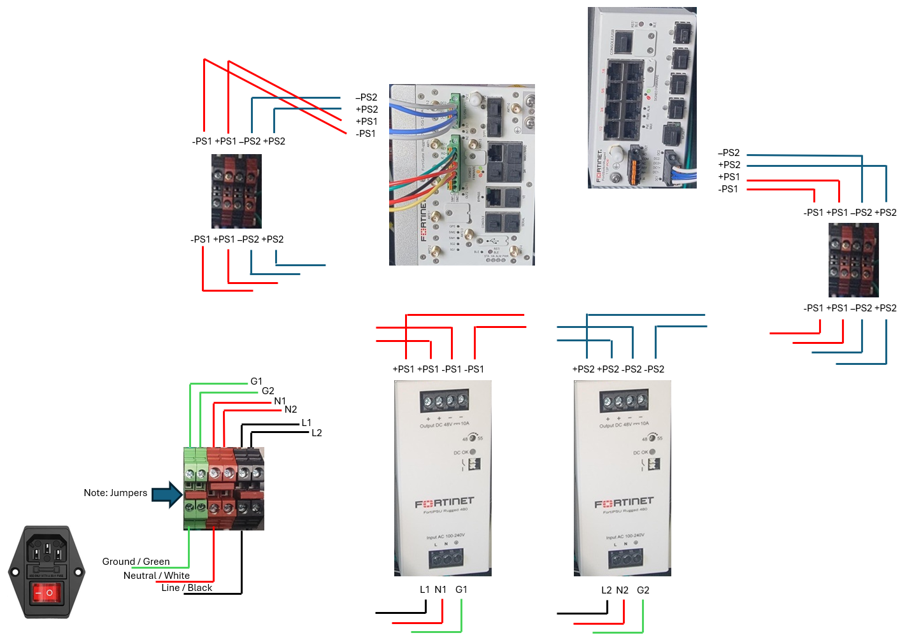

### **Wiring Wall Power Adapter**
- Solder Wires to 3-Prong Adapter
- Use standard colors for US single-phase AC:
   - Line/Black
   - Neutral/White
   - Earth-Ground/Green
- Use shrink tubing to cover soldered connections
- Cut wires to length for inserting/affixing to DIN Rail Terminal Blocks 
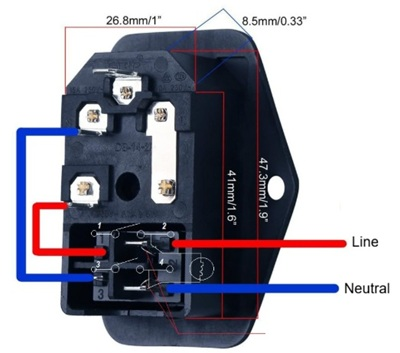

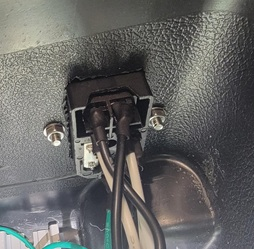

### **Wiring Wall Power Adapter to AC Terminal Blocks**
- Picture below shows 2 each of terminal blocks (appropriate for 2 Power Supplies)
- **Note:** Jumper used to connect the two terminal blocks
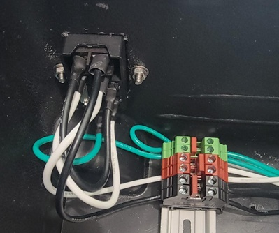

- Picture below shows 3 each of terminal blocks (appropriate for 3 Power Supplies)
- **Note:** Two Jumpers used to connect the three terminal blocks
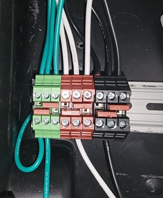

### **Wiring AC Terminal Blocks to DC Power Supplies**
- Use standard colors for US single-phase AC:
   - Line/Black
   - Neutral/White
   - Earth-Ground/Green
- **Note:** Three Power Supplies shown below, Left most is the 12VDC Power Supply [listed in the Digital I/O BOM](Extras/OT_Demo_Lab/Bill_of_Materials/#digital-io-components), the two right most are the Fortinet Rugged Power Supplies
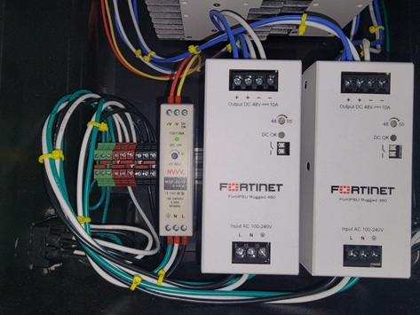

### **Wiring DC Power Supplies to DC Terminal Blocks**
- Suggested 48VDC colors:
   - V+ == Blue
   - V- == White
- If using dual power supplies, do this step twice (once for each Power Supply)
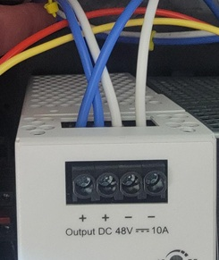

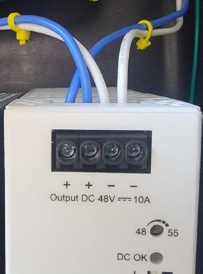

### **Mount and Wire = FGR and FSR**

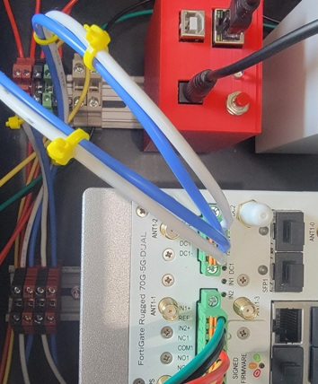

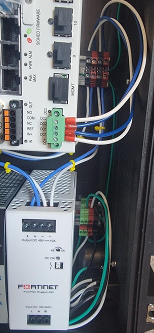

### **Finished**

