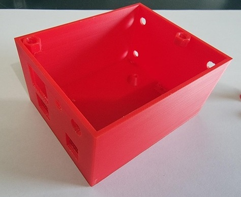
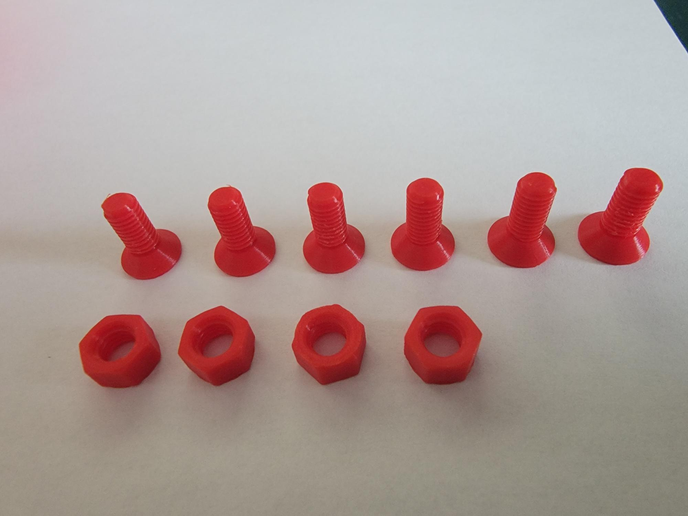
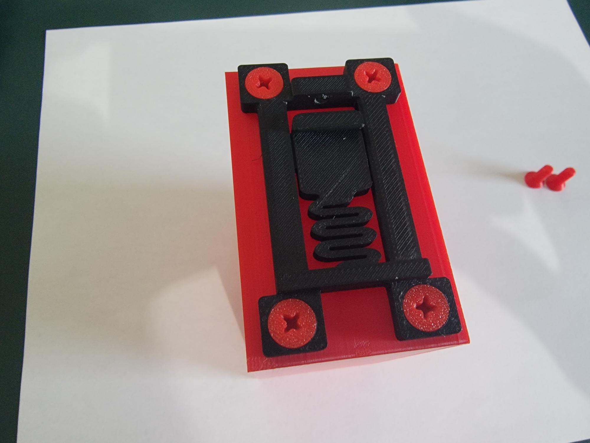
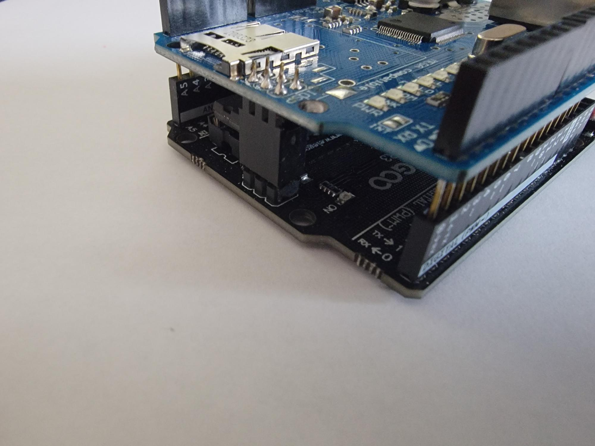
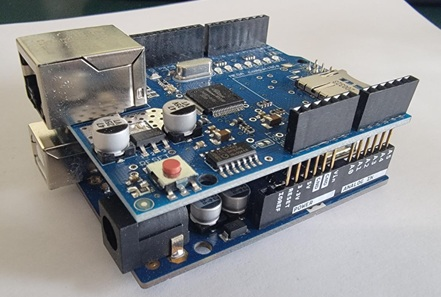
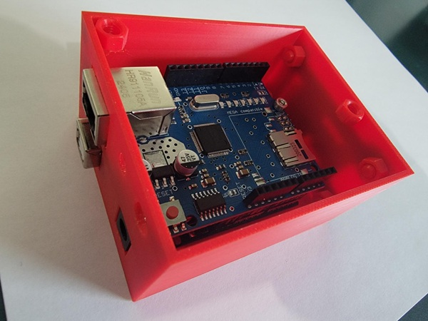
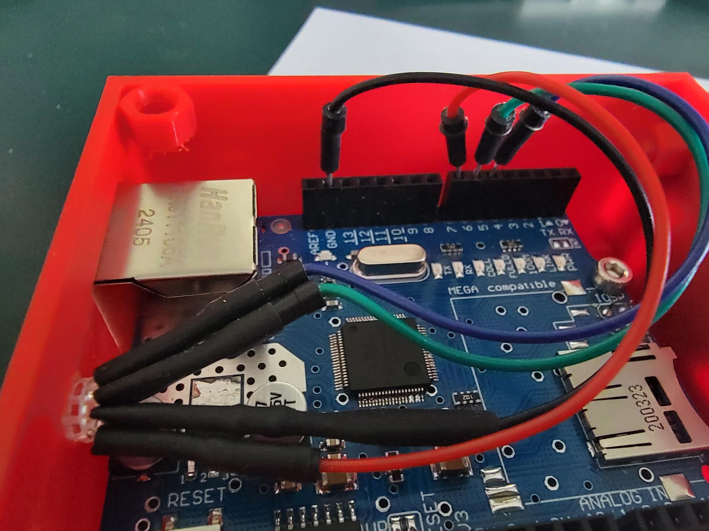
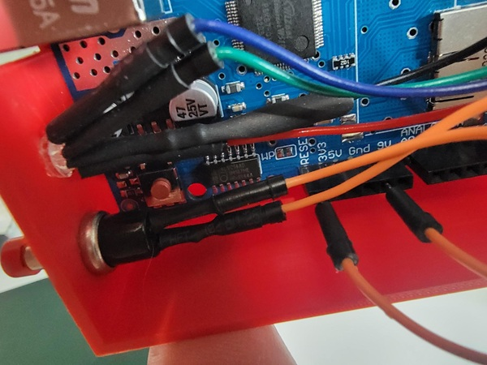
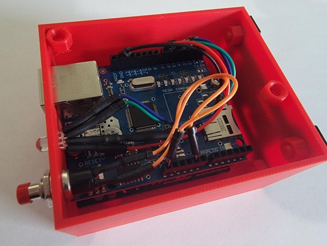

+++
title = "How-To Build Modbus Devices"
type = "default"
weight = 40
+++

**3D Printed Parts 3mf File:**

{}Uno_Ethernet_Enclosure-Box.3mf{}

### **3D Printed Parts**

- Use ONLY small pen screwdriver on bolts (Don't Over Tighten)

### **Attach DIN Rail Mount**

- Attach with nuts on back side (Don't Over Tighten)

### **Attach Ethernet Hat to Arduino UNO**

- Place Hat on UNO (align via pins on back of UNO)

- Final assembly looks like this

### **Insert Arduino UNO with Ethernet Hat**

- Use a single M3 Bolt to affix Arduino to case

### **Wire Push Button and LED**

- LED wires attach as follows
  - Ground - wire with resistor
  - Pin 7 - wire closest to resistor on side with single wire
  - Pin 6 - wire closest to resistor on side with two wires
  - Pin 5 - wire fartherest away from resistor on side with two wires

- Button wires attach as follows
  - Ground - either of the two wires
  - Reset - either of the two wires

- Final assembly looks like this

- Attach lid with two bolts (Don't Over Tighten)
