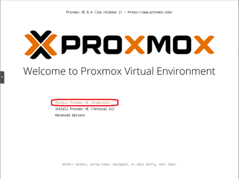
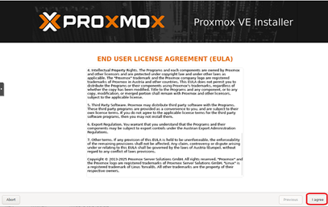
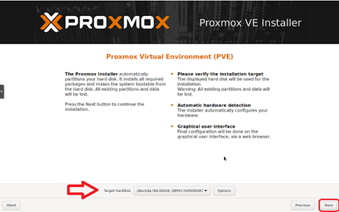
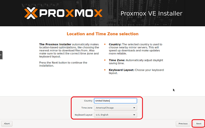
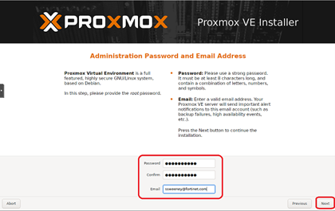
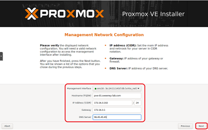
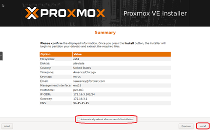
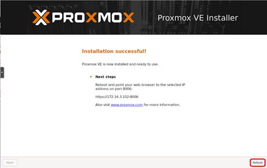

+++
title = "Base Install"
type = "default"
weight = 10
+++

-	Download [latest ISO](https://www.proxmox.com/en/downloads/proxmox-virtual-environment/iso)
-	[Prepare USB Flash Drive](https://pve.proxmox.com/pve-docs/pve-admin-guide.html#installation_prepare_media)
-	Install using [Proxmox VE Installer](https://pve.proxmox.com/pve-docs/pve-admin-guide.html#installation_installer) 
-	Insert the prepared installation USB Flash Drive
-   Hit enter on “Install Proxmox VE (Graphical)"
- Agree to EULA
-	Configure Hard disk by clicking “Next” for default (use whole drive, in a default configuration)
-	Configure Country, Time Zone, Keyboard and click “next” 
-	Set root user password, enter a valid email address and click “next”
- Set Management Interface, Hostname (full FQDN), IP address/subnet, Gateway, DNS
- Uncheck **Automatically Reboot after successful installation**  (provides time to remove USB Flash Drive)
-	Confirm information displayed and click **Next**

- Remove USB Flash Drive, click **Reboot** 

