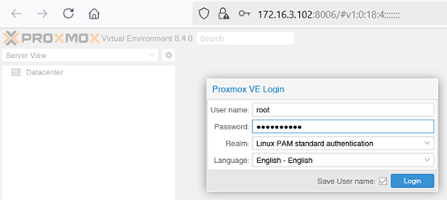
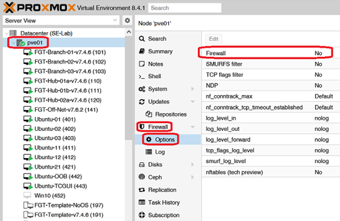
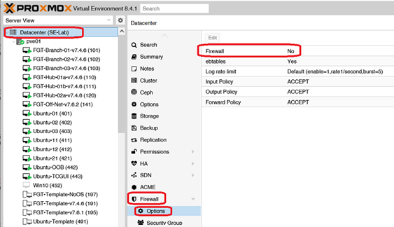
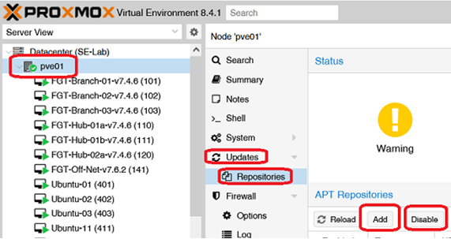
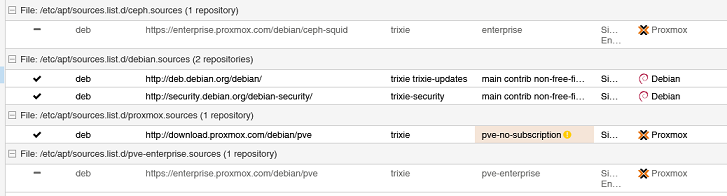
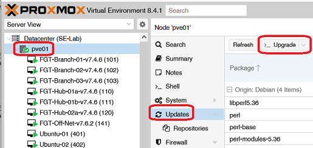
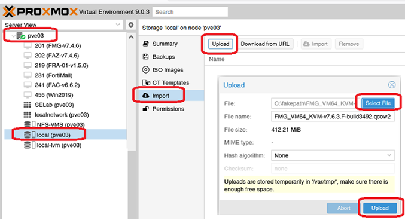

+++
title = "Post Installation - Must Do's"
type = "default"
weight = 20
+++

1.	Login to GUI
    - https://\<host name\> or \<IP address\>:8006
    - Log in as **root (realm PAM)** with password chosen during installation.

2. Firewall Settings
    - Node > Firewall > Option 

    - Datacenter > Firewall > Options

3. Configure **apt-get update** and update PVE server
    - Node > Updates > Repositories

        - Add: Repository >  No-Subscription
        - Disable: `https://enterprise.proxmox.com/debian/ceph-quincy`
        - Disable: `https://enterprise.proxmox.com/debian/pve`

        - Perform upgrade from either CLI or GUI
{}
- If at the end of the following commands, it says reboot....do it.
````bash
apt update –y
apt dist-upgrade –y
apt upgrade -y

````
{}

4. Allow uploading and importing of qcow2 files
    - Add **import** to /etc/pve/storage.cfg file
{}
````bash
dir: local
        path /var/lib/vz
        content iso,vztmpl,backup,import
````
{}
    - Then you should see **Import** listed



