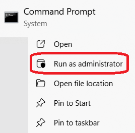

+++
title = "Windows Persistant Route"
type = "default"
weight = 80
+++

Why would do this?  VPN Split Tunnel (SASE) "blocking" access to SE Lab's subnet.

Adding a persistent network route in Windows 11 that survives reboots 

Syntax: `route -p add [destination_network] mask [subnet_mask] [gateway_ip]`

- Steps:
    - Open Command Prompt as Admin: Right-click on CMD
    
    - Example: `route -p add 192.168.50.0 mask 255.255.255.0 192.168.1.1`
    - Verify via CMD: `route print`
