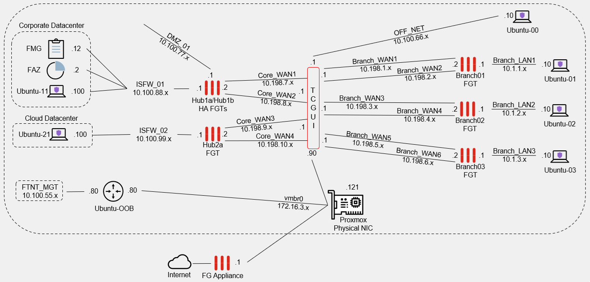
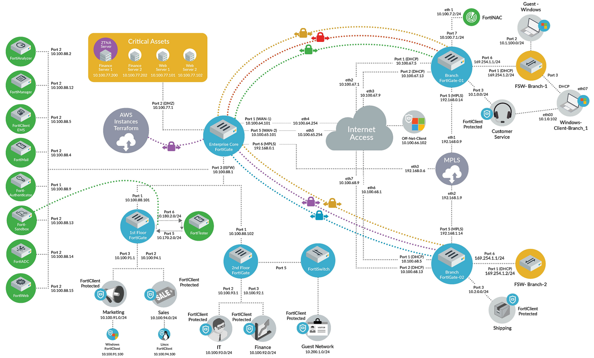

+++
title = "Introduction"
type = "default"
weight = 10
+++

The intent of this Lab Build Guide is to significantly reduce the complexity and time required to setup the "infrastructure" around Fortinet technologies often needed in an SE Lab.  

This Lab removes the need to:
- plan and develop an IP Addressing scheme (this lab uses FNDN's)
- learn, understand and implement WAN Emulation (this lab uses TCGUI)
- plan and install multiple "end user" end points (this lab uses Ubuntu)

Following this lab's step-by-step instructions, the result is the deployment and base config for everything shown in the diagram below and at which point an SE can spend time on learning and utilizing Fortinet technologies.

### **SE Lab Topology**
 

**This lab's network topology and IP addressing scheme was plagerized from FNDN’s Demo/HOL lab topology.** 
 
 

### **Fine Print** 
This steps to build this lab must be followed in order.  The reader cannot can pick and choose which section or installation script to start using.  It is expected the section **[Steps To Build This Lab](Steps)** are followed in order.