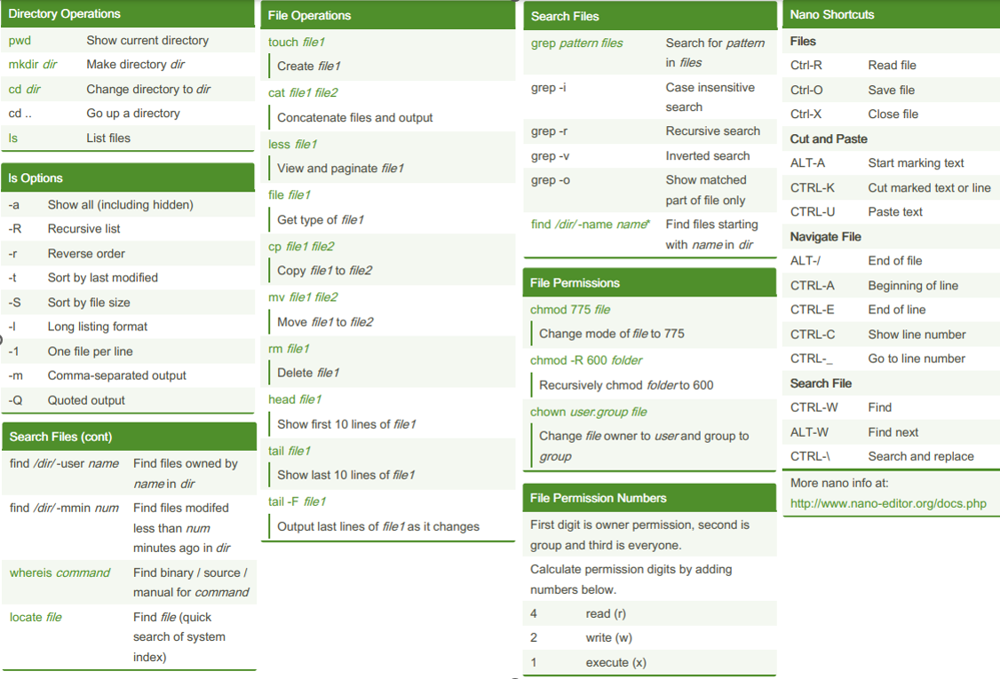
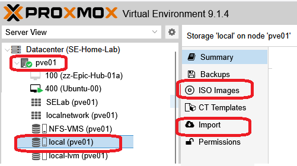

+++
title = "Prerequisites"
type = "default"
weight = 20
+++

### Proxmox Virtual Environment (PVE)
- This lab requires (obviously) a Hypervisor.  This lab was written and installation scripts tested with Proxmox 9.x  

### Accessibility and Tools
- Proxmox Server accessible from your Work laptop via
    -	Web Console via browser **_< PVE Server ip address:8006 >_**
    -	SSH	

### Work laptop has installed or equivalent capable applications:
-	[7-zip](https://www.7-zip.org/)
-	[WinSCP](https://winscp.net/eng/download.php)
-	[Multi-Tabbed PuTTY](https://ttyplus.com/multi-tabbed-putty/)
-	RDP (%windir%\system32\mstsc.exe)
-	Browser - all testing for this build guide was done with [Firefox](https://www.firefox.com/en-US/)

### IP Addressing and Naming Convention Assumptions 
- The VNETs "inside" of this lab use FNDN's IP addressing scheme
    - Documented [here](Introduction/ip_scheme)
    - Shown in the [topology](/Introduction#se-lab-topology)
    - This scheme cannot be changed easily and no script nor mechanism is being provided to do so.
- The "outside" or *physical network* of Proxmox has a default subnet 172.16.3.x/24 with IP's reserved from .2 thru .125
    - This lab requires a full Class C subnet with the first 125 addresses reserved. 
    - Used for the physical interface of PVE server(s)
    - OOB and TCGUI VMs IP addresses
    - OOB VIPs to the "inside"
    - The "outside" subnet can be changed via a script during creation of OOB.

### User Name / Passwords utilizes the following standard
- User Name: fortinet (all lowercase)
- Password: password (all lowercase)

### Basic Understanding and Knowledge of Linux CLI Commands
- [source](https://cheatography.com/davechild/cheat-sheets/linux-command-line?target=_blank)

### Edit text files in Ubuntu (one of the following)
- vi
    - [cheat sheet](https://devhints.io/vim?target=_blank)
    - [how to use](https://www.freecodecamp.org/news/vim-beginners-guide/?target=_blank)
- nano
    - [how to use](https://www.nano-editor.org/dist/latest/cheatsheet.html?target=_blank) 
- Ubuntu [GNOME GUI Text Editor](GUI_Text_Editor.png?target=_blank)

### Upload ISO and qcow2 Files

- Ubuntu Desktop - [64-bit Desktop ISO Image](https://ubuntu.com/download/desktop?target=_blank) 
    - **Note:** Install Scripts tested with 24.04.3 LTS
- Fortinet (FGT/FMG/FAZ) firmware qcow2 files
    - qcow2 files must use the following format:
        - < 3 letters > dash < version > .qcow2
        - FGT-v7.4.8.M.qcow2
        - FMG-v7.6.4.F.qcow2
        - FAZ-v7.4.8.M.qcow2

### Ready to start the build
- **[Steps To Build This Lab](Steps)**