+++
title = "Ansible Prerequisites"
type = "default"
weight = 30
+++

### Create FortiFlex API User and Tokens

**Create API User and Download Credentials**
- Follow the 5 steps in section "**To create an API user:**" on [Docs Fortinet](https://docs.fortinet.com/document/flex-vm/25.4.1/administration-guide/463716/fortiflex-api)

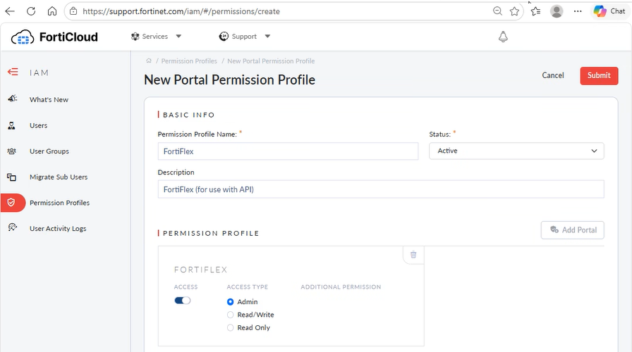
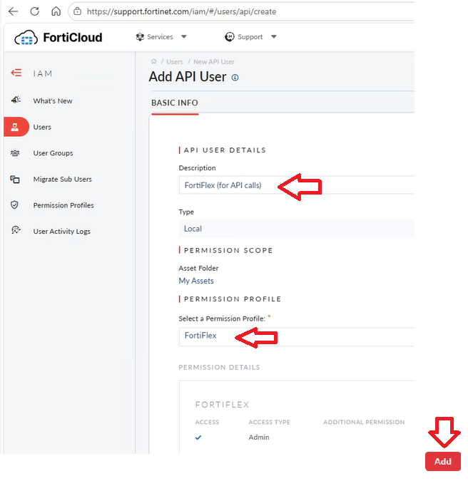
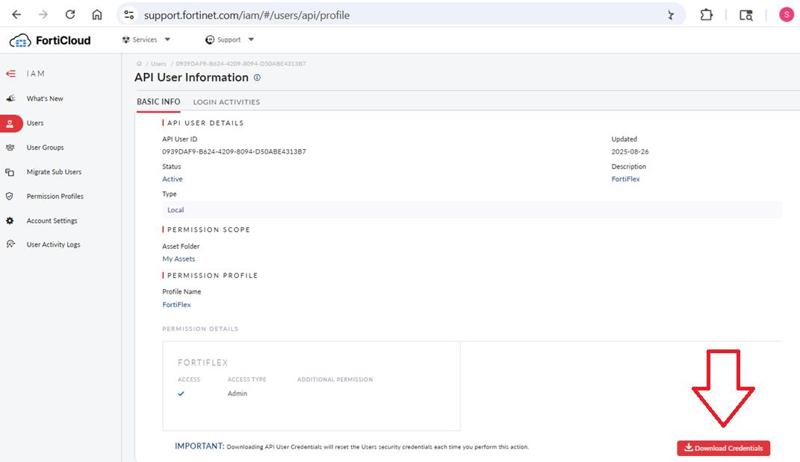


**Create VM Configuration**
- Follow the steps in section "**Creating a VM configuration**" on [Docs Fortinet](https://docs.fortinet.com/document/flex-vm/25.4.1/administration-guide/412722/creating-a-vm-configuration)
- {}Use a consistent naming convention, especially when running multiple lab environments{}
- {}Example below shows Enterprise bundle, but your lab could use UTP or ATP in addition to possibly having OT security services{}
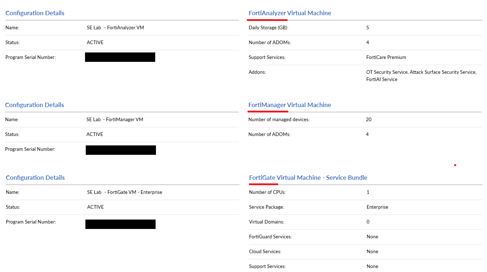

**Create VM entitlements**
- Follow the steps in section "**Creating VM entitlements**" on [Docs Fortinet](https://docs.fortinet.com/document/flex-vm/25.4.1/administration-guide/91804/creating-vm-entitlements)
- {}Description **MUST match exactly** (upper/lower case and dashes) what is outlined in red in the example below{} 
- {}While possible to use a pool of entitlements and have Ansible return the first available (i.e. unassigned) token by configuration id.  However, that is beyond the scope of this how-to build document and left to the reader to investigate and implement.{}

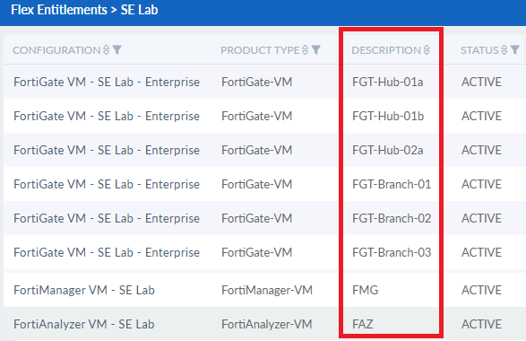

### Create SSH Key on OOB
- Generate SSH Key on Ubuntu-OOB
{}
````bash
ssh-keygen -t rsa -b 4096 -C se_lab@fortinet.internal
  File 	     =>  /home/fortinet/.ssh/ansible_key
  Passphrase =>  <none> just hit enter twice
````
{} 
-	Place public key on Proxmox
{}
````bash
ssh-copy-id -i /home/fortinet/.ssh/ansible_key root@<your pve server name>
````
{} 
- Prompted with the following, respond “yes”
````bash
The authenticity of host 'pve01 (172.16.3.121)' can't be established.
This key is not known by any other names.
Are you sure you want to continue connecting (yes/no/[fingerprint])? yes
````
- Prompted for <your pve server name> password
    - < enter password >
- Verify ability to ssh from Ubuntu-OOB to each PVE server in the cluster without a password
    - **Note:** The first time only, you will be prompted similar to sequence above

{}
````bash
ssh root@<your pve server name 01>
ssh root@<your pve server name 02>
````
{} 

- Update Ansible global.vars file
{}
````bash
cat /home/fortinet/.ssh/ansible_key.pub
````
{}
    - Highlight, Right Click and Copy ansible_key.pub contents
    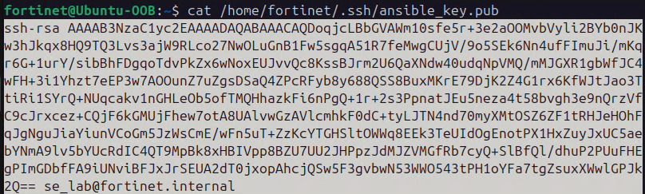
{}
````bash
cd /home/fortinet/automation/ansible/vars
./update_sshkey.sh '<right click - paste SSH KEY here>' (make sure single quotes)
````
{}

### Create Ansible API Token on Proxmox Server
- On PVE Server => create Automation User and API Token (with full Administrator access)
    - Click on: Datacenter/Permissions/Groups
        - Click on Create button	
        - Name:	`IaC-admin-users`
        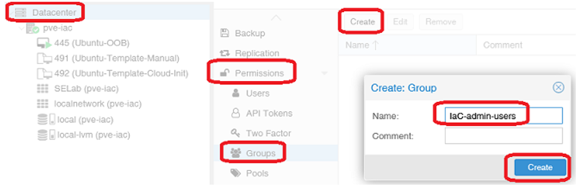
    - Click on: Datacenter/Permissions
        - Click: Add => Group Permission
            - Path: 	/
            - Group:	IaC-admin-users
            - Role: 	Administrator
            - Propagate: 	Checked
        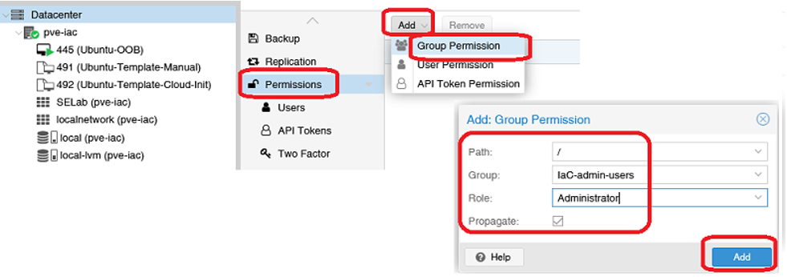
    - Click on: Datacenter/Permissions/Users
        - Click: Add
            - User name: 	`IaC`
            - Realm: 	Linux PAM standard authentication
            - Group:	IaC-admin-users
            - Expires:	never
            - Enabled:	checked
        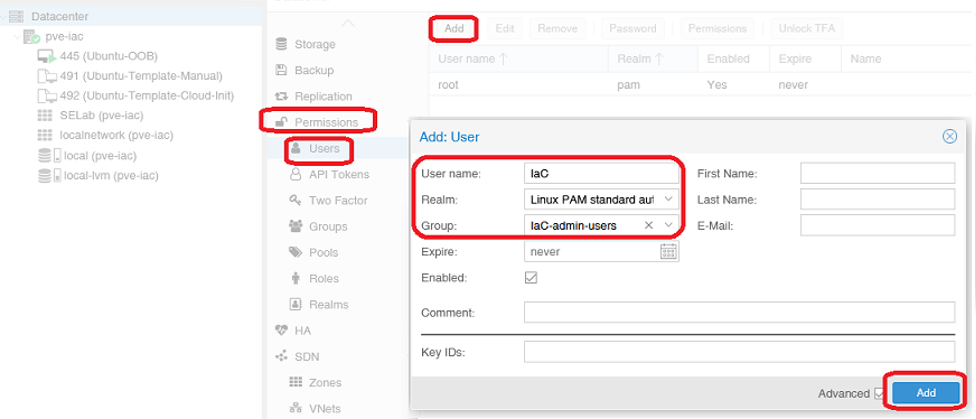
    - Click on: Datacenter/Permissions/API Tokens
        - Click: Add
            - User: IaC
            - Token ID: `Automation`
            - Privilege Separation: Unchecked
        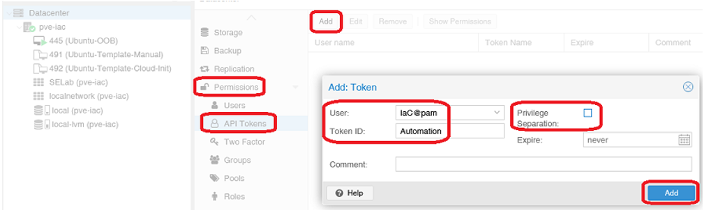
    - Copy the Token ID and Secret generated
        - **Note:** Secret value is only displayed once when token generated
        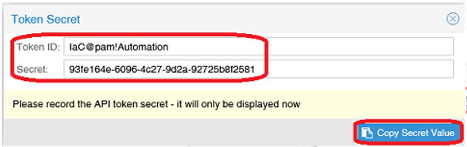
    - Update **proxmox_api_token_secret:**
{}
````bash
cd /home/fortinet/automation/ansible/vars
./update_api_token_secret.sh  <Token Secret here>
````
{}

### Update Global VARS File on Ubuntu-OOB
- Update **global.yml** file located in **/home/fortinet/automation/ansible/vars/**
{}
````bash
cd /home/fortinet/automation/ansible/vars
````
{}
    - Update FortiFlex **Username/Password, Account ID and Serial Number**
{}
- The username/password below is not what you use to sign into Support Portal
- It is the API's credentials 
````bash
./update_fortiflex_username.sh   <FortiFlex Username here>
./update_fortiflex_password.sh  '<FortiFlex Password here>'  <- Make sure to use single quotes
./update_fortiflex_accountID.sh  <FortiFlex Account ID here>
./update_fortiflex_SN.sh         <FortiFlex Serial Number here>
````
{}

    - Update **fortinet_timezone:** US/Central <= Default Timzone **(no change needed if this is your timezone)**
{}
````bash
./update_timezone.sh  <examples: US/Eastern, US/Mountain, US/Pacific>
````
{}
    - Update **proxmox_api_host:** pve01		<= Default PVE Server name **(Following changes NOT needed if == pve01)**
{}
````bash
./update_pve_server_name.sh  <Your PVE Server Name>
````
    - Also:

        - Edit file **/automation/ansible/vars/all-hosts.yml**
            -   Search for pve01 and change to your server name

        - Edit file **/automation/ansible/inventory/inventory.yml**
            -   Search for pve01 and change to your server name
{}
    - Update **proxmox_storage_name:** local-lvm	<= if storage on PVE, or NAS name if not
{}
````bash
./update_storage_name.sh  <local-lvm if default, or NAS name if not>
````
{}
    - Update **proxmox_storage:** /var/lib/vz	<= if storage on PVE, or /mnt/pve/**_< NFS name >_** if using NAS
{}
````bash
./update_VM_image_directory.sh  <directory where VM images reside>
````
{}
    - Update **proxmox_ubuntu_template_name:** Ubuntu-Template <= Name of Ubuntu template
{}
````bash
./update_ubuntu_template_name.sh  <VM Template Name>
````
{}
    - Update **proxmox_ubuntu_template_vmid:** 491 <= VMID of Ubuntu VM Template
{}
````bash
./update_ubuntu_template_vmid.sh  <VM Template VMID>
````
{}
    - **Verify**
{}
````bash
cat global.yml
````
{}
    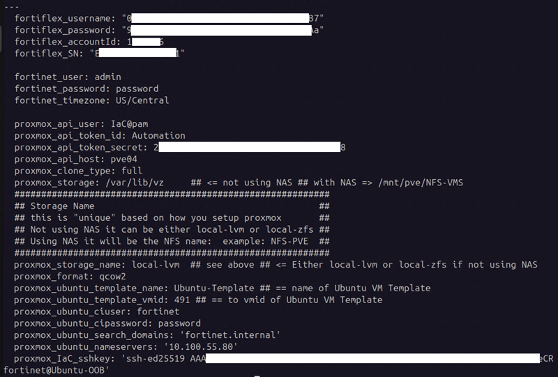

### DNS

All hosts and VMs can be resolved by name.
{}
````bash
ping <your pve server name>
ping Ubuntu-OOB
````
{} 

### QCOW2 Files Uploaded

qcow2 files must have the following format:

< 3 letters > dash < version > .qcow2
- FGT-v7.6.6.M.qcow2
- FMG-v7.6.6.M.qcow2
- FAZ-v7.6.6.M.qcow2

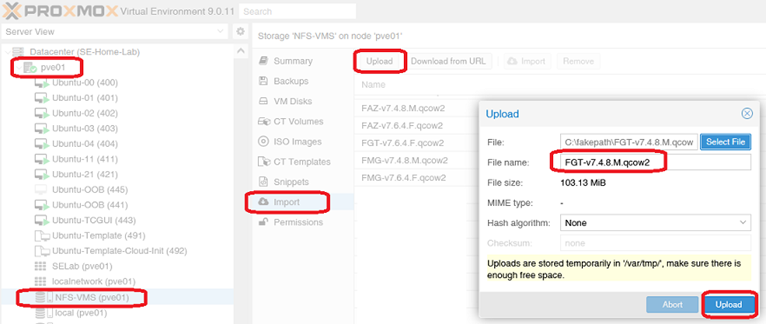

### Complete