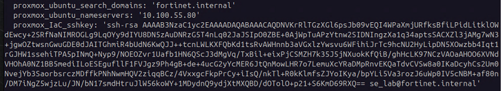
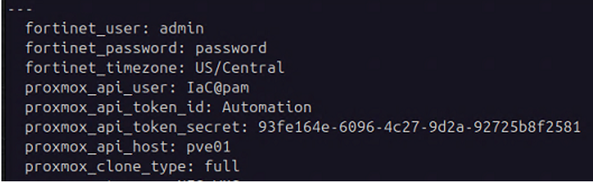

+++
title = "Ansible Prerequisites"
type = "default"
weight = 30
+++

**SSH Key**
- Generate SSH Key on Ubuntu-OOB
{}
````bash
ssh-keygen -t rsa -b 4096 -C se_lab@fortinet.internal
  File 	     =>  /home/fortinet/.ssh/ansible_key
  Passphrase =>  <none> just hit enter twice
````
{} 
-	Place public key on Proxmox
{}
````bash
ssh-copy-id -i /home/fortinet/.ssh/ansible_key root@<your pve server name>
````
{} 
- Prompted with the following, respond “yes”
````bash
The authenticity of host 'pve01 (172.16.3.121)' can't be established.
This key is not known by any other names.
Are you sure you want to continue connecting (yes/no/[fingerprint])? yes
````
- Prompted for <your pve server name> password
    - < enter password >
- Verify ability to ssh from Ubuntu-OOB to each PVE server in the cluster without a password
    - **Note:** The first time only, you will be prompted similar to sequence above

{}
````bash
ssh root@<your pve server name 01>
ssh root@<your pve server name 02>
````
{} 

-	Edit Ansible global.vars file
{}
````bash
cat /home/fortinet/.ssh/ansible_key.pub
````
{}
    - Highlight, Right Click and Copy ansible_key.pub contents
    
    - Edit **global.yml** located in **/home/Fortinet/automation/ansible/vars/**
        - **proxmox_IaC_sshkey** is located at bottom of file
        - *MAKE SURE* there are single quotes at beginning and end of key
             

**Ansible API Token**
- On PVE Server => create Automation User and API Token (with full Administrator access)
    - Click on: Datacenter/Permissions/Groups
        - Click on Create button	
        - Name:	IaC-admin-users
        
    - Click on: Datacenter/Permissions
        - Click: Add => Group Permission
            - Path: 	/
            - Group:	IaC-admin-users
            - Role: 	Administrator
            - Propagate: 	Checked
        
    - Click on: Datacenter/Permissions/Users
        - Click: Add
            - User name: 	IaC
            - Realm: 	Linux PAM standard authentication
            - Group:	IaC-admin-users
            - Expires:	never
            - Enabled:	checked
        
    - Click on: Datacenter/Permissions/API Tokens
        - Click: Add
            - User: IaC
            - Token ID: Automation
            - Privilege Separation: Unchecked
        
    - Copy the Token ID and Secret generated
        - **Note:** Secret value is only displayed once when token generated
        
- On Ubuntu-OOB VM
    - Edit **global.yaml** located in **/home/fortinet/automation/ansible/vars/**
    - Update the following:
        - Token ID and Secret
        - fortinet_timezone: US/Central
        - proxmox_api_host: pve01		<= DNS name of PVE Server
        - proxmox_storage: NFS-VMS	<= if not using NAS this should be lvm-local
        - proxmox_ubuntu_template_name: Ubuntu-Template <= Name of Proxmox template used for ansible
        

**DNS**

All hosts and VMs can be resolved by name.
{}
````bash
ping <your pve server name>
ping Ubuntu-OOB
````
{} 


**Global VARS File on Ubuntu-OOB:**

The following file is updated with your lab’s specific configuration:

~~~~bash
/home/fortinet/automation/ansible/vars/global.yml
~~~~
- API User/Token/host	
- *Storage* - Directory where VM Disk Images and qcow2 files being imported
- *Storage_Name* - Name of Storage 
- Ubuntu Template Name and vmid


**QCOW2 Files Uploaded**

qcow2 files must have the following format:

< 3 letters > dash < version > .qcow2
- FGT-v7.4.8.M.qcow2
- FMG-v7.6.4.F.qcow2
- FAZ-v7.4.8.M.qcow2


