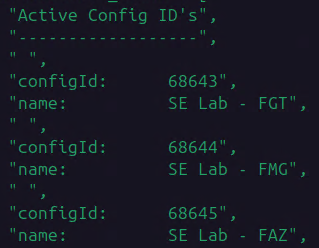

+++
title = "Create FortiGate VMs"
type = "default"
weight = 50
+++

- If you get the error {}No route to host{} with any of the following steps, use the **[Troubleshoot Ansible](/Extras/Troubleshoot_Ansible)** steps

### Copy Bootstrap ISO's, Create VM's, Start VM's
{}
````bash
cd /home/fortinet/automation/ansible/fortinet
````
{}
{}
- Copy bootstrap ISO's to Proxmox server
````bash
./copy_fgt_bootstrap_iso.sh ../vars/all-hosts.yml  <PVE server name>
````
{}
{}
- Create the FGT VM's on Proxmox
````bash
./create-vm.sh              ../vars/all-hosts.yml  <PVE server name>  fortigate_sdwan v7.6.6.M
````
{}
{}
- Start the VM's just created
````bash
./start_remove_vm.sh        ../vars/all-hosts.yml  <PVE server name>  fortigate_sdwan started
````
{}

### List FortiFlex Config IDs
{}
- List the Config IDs for each configuration created in the **Ansible Prerequisites** step [Create VM Configuraion](steps/ansible/#create-vm-configuration) 
````bash
cd /home/fortinet/automation/ansible/fortiflex
````
````bash
./flex-configs-list.sh 
````
{}
{}



{}

### Pull FortiFlex Tokens

{}
````bash
cd /home/fortinet/automation/ansible/fortiflex
````
{}
{}
- Use the three Config IDs (FGT, FMG and FAZ) from the output received from the previous section to pull the FortiFlex tokens 
- Do the following command 3 times (for each configID)
````bash
./flex-entitlements.sh <configId from previous section> 
````
- Verify **.lic** files and contents 
    - Located here: `/home/fortinet/automation/ansible/fortinet/license`
{}


### Install FortiFlex Tokens
{}
````bash
cd /home/fortinet/automation/ansible/fortiflex
````
{}
{}
- Make sure all FortiGate VMs have fully started before exeucting the following.
    - Suggest opening FGT's console windows and verifying login prompt showing for all FGT's.
- **Note:** This next script will "fail", but is successful if VM’s reboot 
````bash
./install_flex_token.sh  fortigate_sdwan
````
{}

### Finish Configuring FortiGates
{}
- Make sure all FortiGate VMs have fully started before exeucting the following.
    - Suggest opening FGT's console windows and verifying login prompt showing for all FGT's.

````bash
./configure_fgt.sh       fortigate_sdwan
````
- Configure the HA Pair - Hub01a / Hub01b
````bash
./make_ha.sh             fortigate_hub_ha
````
{}