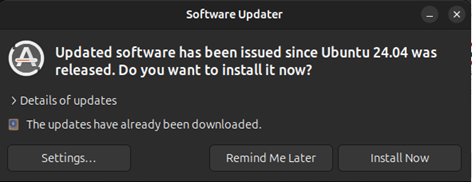

+++
title = "Create OOB Management VM"
type = "default"
weight = 20
+++

### Create Full Clone and Install Packages
-	Create Full Clone of “Ubuntu-Template” by right clicking on the VM Template
    - VM ID: `441`
    - Name: `Ubuntu-OOB`
 
- Verify Hardware, specifically 2 NICs: net0 == vmbr0, net1 == FTNTMGT
 
- Configure Cloud-Init per [IP addressing scheme](introduction/ip_scheme)
    - NET0
        - The 4th Octet for this VM **MUST be** x.y.z.80 
        - If not using the default 172.16.3.x subnet, put in yours
        - Example: *ip=192.168.10.80,gw=192.168.10.1*
    - NET1 
        - 10.100.55.80/24
        - NO Gateway
 
 
- Start the OOB VM
- RDP to OOB VM
    - **Note:** Using RDP will be “EASIER” as it allows “cut and paste”

- If you see the following dialog, click on *"Remind Me Later"*

{}
- Pull the latest OOB install scripts from github repository
````bash
cd /home/fortinet/Downloads/
````
````bash
git clone https://github.com/fortinet/Field-SE-Lab-OOB /home/fortinet/Downloads
````
````bash
chmod 744 *.sh
````
{}
{}
- Run the following script _**ONLY IF**_ changing the external default subnet from 172.16.3.x **(provide ONLY the first 3 octets)**
- Example: ./update_subnet.sh 192.168.10
````bash
./update_subnet.sh <external subnet to SE Lab> 
````
{}
{}
- Next start the install script
````bash
./OOB_Install.sh
````
-	**Note:** VM will auto reboot after “OOB_Install.sh” script runs
{}
{}
- Install Containers
````bash
cd /home/fortinet/Downloads/
````
````bash
./OOB_Containers.sh
````
{}

### Configuraion
-	RDP to OOB VM
    - **Note:** Using RDP will be “EASIER” as it allows “cut and paste”

- **DNS (CoreDNS)**
    - {}Important{} - *UPDATE REQUIRED* if your PVE Server Name is NOT "PVE01" or if 4th octet is NOT 121.  If different, update the two "db" files listed below. 
    - DNS is critical for Ansible automation 
    - [CoreDNS](https://di-marco.net/blog/it/2024-05-09-Intall_and_configure_coredns/) has been preconfigured for this [topology](/Introduction#se-lab-topology)
    - Two [RFC 1035-style](https://www.rfc-editor.org/rfc/rfc1035) zone database files have been preconfigured here:
        - **/home/Fortinet/c_data/coredns/conf/zones**
            - **db.fortinet.internal**	<= intended for endpoints “internal” to  proxmox
            - **db.home.internal**		<= intended for endpoints “external” to proxmox
    {}
- If changes are made to zone database files, execute the following:
````bash
docker compose down
````
````bash
docker compose up -d  
````
{}

- **homepage**
    - homepage available via browswer via OOB's IP **_< 172.16.3.80 >_** *or via the subnet you changed to from the default*
    - [homepage](https://gethomepage.dev/) is a customizable application dashboard
    -  YAML files located here: **/home/fortinet/c_data/homepage/config**
        - **bookmarks.yaml** <= [URL's for GUI and SSH access to Lab VM’s](https://gethomepage.dev/configs/bookmarks/) Only change needed is Home FGT name/IP address
        - **services.yaml**  <= [ProxMox Server GUI URL/Status](https://gethomepage.dev/widgets/services/proxmox/) Only change needed is Proxmox Server name/IP address/API Key
        - **settings.yaml**  <= [Column Headings/Layout](https://gethomepage.dev/configs/settings/) No change needed
        - **widgets.yaml**	<= [Date/Time](https://gethomepage.dev/widgets/info/datetime/) – [Weather/Location](https://gethomepage.dev/widgets/info/openweathermap/) Only change needed is city name, long/lat for weather
    - Configure Proxmox Server API Key for the [Proxmox Widget](https://gethomepage.dev/widgets/services/proxmox/)
        - On the PVE Server => Create User and API Token
            - Click on: Datacenter/Permissions/Groups
                - Click on Create button	
                - Name:	`Homepage-readonly-users`
                <br />
            - Click on: Datacenter/Permissions
                - Click: Add => Group Permission
                    - Path: 	/
                    - Group:	Homepage-readonly-users
                    - Role: 	PVEAuditor
                    - Propagate: 	Checked
                <br />
            - Click on: Datacenter/Permissions/Users
                - Click: Add
                    - User name: 	`Homepage`
                    - Realm: 	Linux PAM standard authentication
                    - Group:	Homepage-readonly-users
                    - Expires:	never
                    - Enabled:	checked
                <br />
            - Click on: Datacenter/Permissions/API Tokens
                - Click: Add
                    - User: Homepage@pam
                    - Token ID: `api-readonly`
                    - Privilege Separation: Unchecked
                <br />
            - Copy the Token ID and Secret generated
                - **Note:** Secret value is only displayed once when token generated
                <br />
        - On Ubuntu-OOB VM
            - Edit **services.yaml** located in **/home/fortinet/c_data/homepage/config**
            - Update PVE Server Name, PVE Server IP address, and API Secret/password as shown below
                <br />
- **Guacamole**
{}
- Load a preconfigured Guacamole database
````bash
cd  /home/fortinet/c_data/guacamole
````
````bash
docker compose ps
````
````bash
docker compose cp ./dump.sql guacamole-sql:/dump.sql
````
````bash
docker compose exec guacamole-sql /bin/sh
````
````bash
sh-5.1# mysql -u root -p <  ./dump.sql
````
````bash
Enter password: password
````
````bash
sh-5.1# exit
````
````bash
docker compose down
````
````bash
docker compose up –d
````
{}
    - There are *NO ADDITIONAL CHANGES REQUIRED* => [Guacamole](https://guacamole.apache.org/) has been preconfigured for this [topology](/Introduction#se-lab-topology)
    - In the future when your lab has additions/changes, see **[Guacamole](/extras/guacamole/)** section.
 
### Verification 
- "homepage" is working
    - via Work Laptop browser: [http://172.16.3.80](http://172.16.3.80) **(URL should reflect your subnet if not-default)**
- Guacamole is working
    - via Work Laptop browser: [http://172.16.3.80:8080/guacamole](http://172.16.3.80:8080/guacamole) **(URL should reflect your subnet if not-default)**
        - **User:** 		*guacadmin*
        - **Password:** 	*guacadmin*

{}
- DNS is working
````bash
ping oob
````
````bash
ping oob.home.internal
````
````bash
ping oob.fortinet.internal
````
{}
 
{}
- NAT/Forwarding working
    - Should see multiple: **_PREROUTING 172.16.3.X (or your subnet if not-default) addresses_** and **_POSTROUTING MASQUERADE_**
````bash
sudo iptables -t nat -L -n -v
````
{}

### Complete
