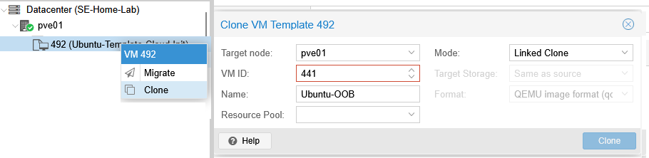
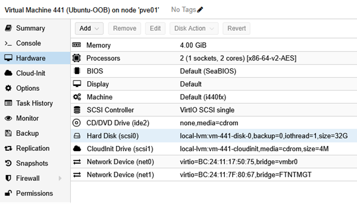
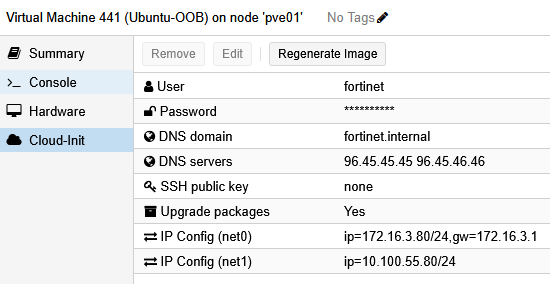
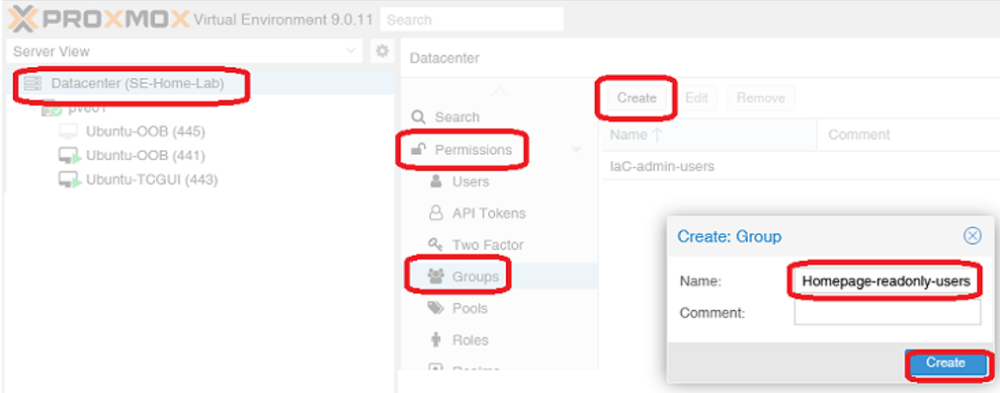
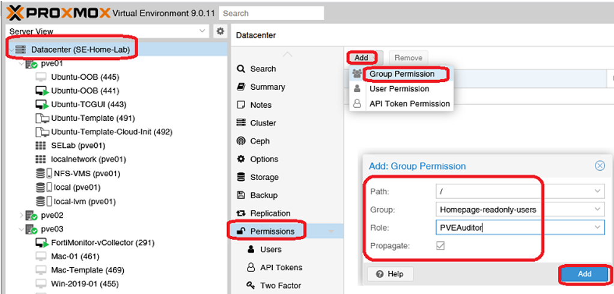
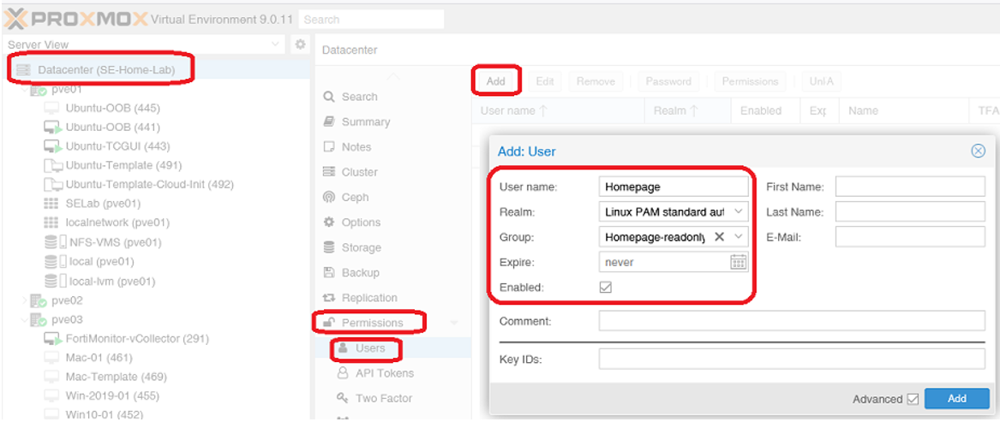
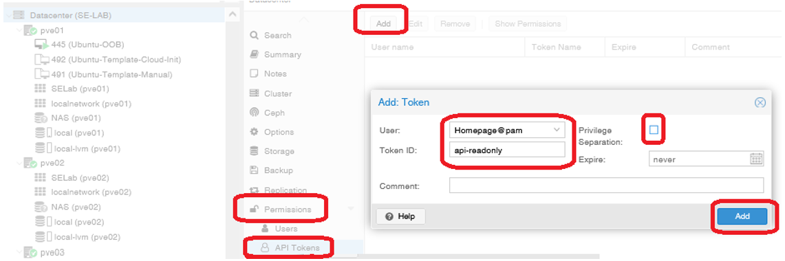
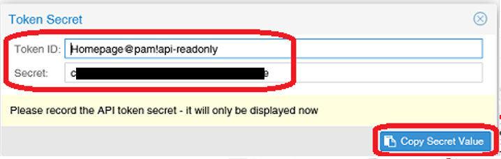
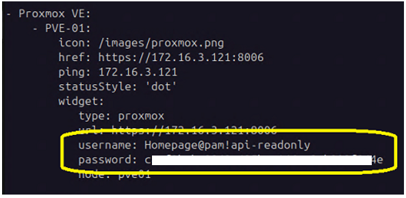

+++
title = "Create OOB Management VM"
type = "default"
weight = 20
+++

### Create Full Clone and Install Packages
-	Create Full Clone of “Ubuntu-Template” by right clicking on the VM Template
    - VM ID: 441
    - Name: Ubuntu-OOB
 
- Verify Hardware, specifically 2 NICs: net0 == vmbr0, net1 == FTNTMGT
 
- Configure Cloud-Init 
 
 
- Click on Console and Click on Start
{}
````bash
git clone https://github.com/stevesweeneywisc/SE-Lab-OOB /home/fortinet/Downloads
cd /home/fortinet/Downloads/

chmod 777 *.sh

./OOB_Install.sh
````
{}
-	**Note:** VM will auto reboot after “OOB_Install.sh” script runs
{}
````bash
cd /home/fortinet/Downloads/

./OOB_Containers.sh
````
{}

### Configuraion
-	RDP to OOB VM
    - **Note:** Using RDP will be “EASIER” as it allows “cut and paste”

- **DNS (CoreDNS)**
    - {}Important{} - *UPDATE REQUIRED* if your PVE Server Name is NOT "PVE01".  If different, update the two "db" files listed below. 
    - DNS is critical for Ansible automation 
    - [CoreDNS](https://di-marco.net/blog/it/2024-05-09-Intall_and_configure_coredns/) has been preconfigured for this [topology](/Introduction#se-lab-topology)
    - Two [RFC 1035-style](https://www.rfc-editor.org/rfc/rfc1035) zone database files have been preconfigured here:
        - **/home/Fortinet/c_data/coredns/conf/zones**
            - **db.fortinet.internal**	<= intended for endpoints “internal” to  proxmox
            - **db.home.internal**		<= intended for endpoints “external” to proxmox
    - If changes are made to zone database files, execute the following:
{}
````bash
docker compose down

docker compose up -d  
````
{}

- **"homepage"**
    - homepage available via browswer via OOB's IP **_< 172.16.3.80 >_**
    - [homepage](https://gethomepage.dev/) is a customizable application dashboard
    -  YAML files located here: **/home/fortinet/c_data/homepage/config**
        - **bookmarks.yaml** <= [URL's for GUI and SSH access to Lab VM’s](https://gethomepage.dev/configs/bookmarks/)
        - **services.yaml**  <= [ProxMox Server GUI URL/Status](https://gethomepage.dev/widgets/services/proxmox/)
        - **settings.yaml**  <= [Column Headings/Layout](https://gethomepage.dev/configs/settings/)
        - **widgets.yaml**	<= [Date/Time](https://gethomepage.dev/widgets/info/datetime/) – [Weather/Location](https://gethomepage.dev/widgets/info/openweathermap/)
    - Configure [Proxmox Widget](https://gethomepage.dev/widgets/services/proxmox/)
        - On the PVE Server => Create User and API Token
            - Click on: Datacenter/Permissions/Groups
                - Click on Create button	
                - Name:	`Homepage-readonly-users`
                <br />
            - Click on: Datacenter/Permissions
                - Click: Add => Group Permission
                    - Path: 	/
                    - Group:	Homepage-readonly-users
                    - Role: 	PVEAuditor
                    - Propagate: 	Checked
                <br />
            - Click on: Datacenter/Permissions/Users
                - Click: Add
                    - User name: 	`Homepage`
                    - Realm: 	Linux PAM standard authentication
                    - Group:	Homepage-readonly-users
                    - Expires:	never
                    - Enabled:	checked
                <br />
            - Click on: Datacenter/Permissions/API Tokens
                - Click: Add
                    - User: Homepage@pam
                    - Token ID: `api-readonly`
                    - Privilege Separation: Unchecked
                <br />
            - Copy the Token ID and Secret generated
                - **Note:** Secret value is only displayed once when token generated
                <br />
        - On Ubuntu-OOB VM
            - Edit **services.yaml** located in **/home/fortinet/c_data/homepage/config**
            - Update PVE Server Name, PVE Server IP address, and API Secret/password as described below
                <br />
- **Guacamole**
    - Following steps need executed
{}
````bash
docker compose ps

docker compose cp ./dump.sql guacamole-sql:/dump.sql
	 
docker compose exec guacamole-sql /bin/sh

sh-5.1# mysql -u root -p <  ./dump.sql

Enter password: password

sh-5.1# exit

docker compose down

docker compose up –d
````
{}
    - *NO ADDITIONAL CHANGES REQUIRED* => [Guacamole](https://guacamole.apache.org/) has been preconfigured for this [topology](/Introduction#se-lab-topology)
    - See **[Guacamole](/extras/guacamole/)** section if additions and or changes required in the future
 
### Verification 
- "homepage" is working
    - via Work Laptop browser: [http://172.16.3.80](http://172.16.3.80)
- Guacamole is working
    - via Work Laptop browser: [http://172.16.3.80:8080/guacamole](http://172.16.3.80:8080/guacamole)
        - User: 		guacadmin
        - Password: 	guacadmin
- DNS is working
{}
````bash
ping oob
ping oob.home.internal
ping oob.fortinet.internal
````
{}
- NAT/Forwarding working
    - Should see multiple: **_PREROUTING 172.16.3.X addresses_** and **_POSTROUTING MASQUERADE_**
{}
````bash
sudo iptables -t nat -L -n -v
````
{}

### Complete
