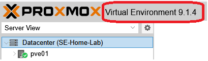

+++
title = "Proxmox Install"
type = "default"
weight = 3
+++

- {}Note{} The scripts/steps in this guide tested against 9.x, but will likely work with 8.x too)

### Base Install
- **[Base Install](Base_Install)**

### Post Installation "Must Do's"
- **[Post Installation "Must Do's"](Post_Installation)**

### Installation Complete

**Reference Only** => the "Official" Proxmox documentation
-	[PVE Docs](https://pve.proxmox.com/pve-docs/)
-	[PVE Wiki](https://pve.proxmox.com/wiki/Main_Page)
