+++
title = "Create Ubuntu VM Template"
type = "default"
weight = 10
+++

### Create the VM
In PVE GUI  > (left click) Datacenter > (right click) Node > Create VM
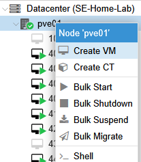

- General
    - Choose Node
    - Choose VM_id == `491`
    - Type VM Name == `Ubuntu-Template`
- OS
    - Use CD/DVD disc image
    - Storage: <your Proxmox storage, if no NAS, then “local”>	
    - ISO Image: Ubuntu_Installer.iso
    - Default values for 'Guest OS' (Linux 6.x – 2.6 Kernel)
- System
    - Leave Defaults:
        - Graphic Card: Default     
        - Machine: Default (i440fx)	
        - Bios: Default (SeaBios)    
        - SCSI: VirtIO single
    - Tick: “Qemu Agent”
- Disks
    - Create Disk
        - SCSI 0
        - Storage: <your Proxmox storage, if no NAS, then “local-lvm”>
        - Disk Size (GB): 32
        - Untick: "Backup"   (Not shown when using "local-lvm")
- CPU
    - Cores == 2 cores
    - Type == Default (x86-64-v2-AES)
- Memory
    - Memory (MB): 2048  <= this is minimum...recommend 4096 
- Network
    - Bridge == vmbr0
    - Untick Firewall
- Confirm
    - Click Finish

- Add a 2nd NIC
    - In PVE GUI > (left click) Datacenter > Node > VM (one just created) > Hardware > Add > Network Device
        - Bridge == FTNTMGT  (uncheck Firewall)

- VM’s config should look like the following.
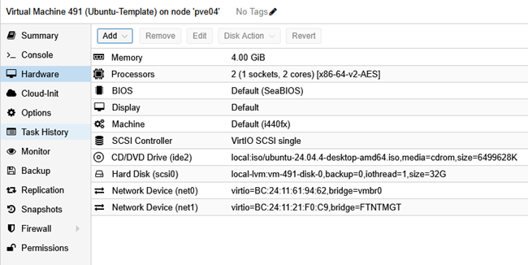

### Install Ubuntu
- In PVE GUI  > (left click) Datacenter > Node > VM (the vm just created)
    - Click on Console and Click on Start
- Press Enter on “Try or Install Ubuntu” (if no keys pressed, GRUB will timeout and choose this option)
-	If following appears, you can safely ignore it as both NICs have NOT been fully configured yet.
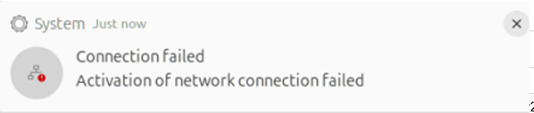
- If you see the following Icon, click on it
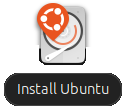
-	Choose Language, Accessibility, Keyboard, Internet Do Not Connect,  
-	Click on Install Ubuntu, Interactive installation, Apps – Default selection, Do not install proprietary software
-	Erase disk and install Ubuntu (start from scratch on selected disk) 
    |  |  |
    | :- | :- | 
    | Your name	| `fortinet` (all lower case) |
    | Computer name	| `Ubuntu-Template` |
    | User name	| `fortinet` (all lower case) |
    | Password | `password` |
    | Leave checked “Require my password to login” | <= critical for next script to run successfully |
    |Timezone | America/Chicago |
-	Click on “Install”
-	When screen says:
    - “Ubuntu 24.04.4 LTS installed and ready to use”
    -  Click on “Restart Now”
- At the prompt to remove installation media
    - In PVE GUI  
        - Datacenter > Node > VM (one just created) >  Hardware > CD/DVD Drive > Edit 
            - Tick “Do not use any media”
            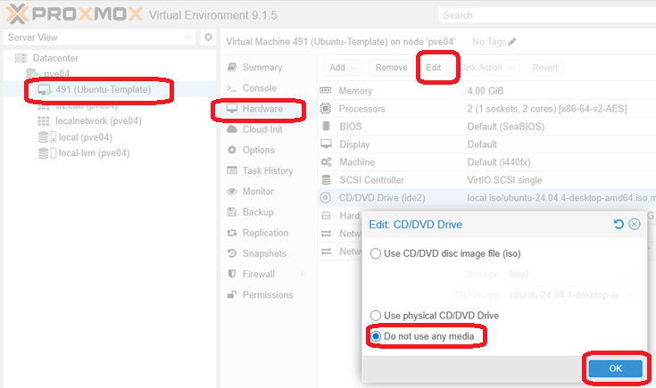
        - Datacenter > Node > VM (one just created) >  Hardware > Add > Cloud-Init
            - Bus/Device: SCSI 1
            - Storage: <your Proxmox storage, if no NAS, then “local-lvm”>
            - Format: QEMU image format (if it's available)
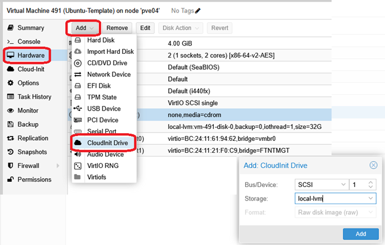
    - Config Cloud-Init
    - {}NOTE:{} If NOT using default subnet 172.16.3.x, then config IP address and gateway appropriately
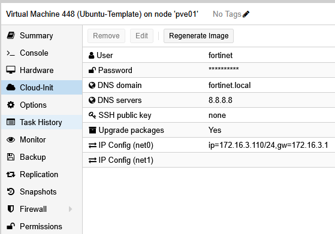  
- Go back to VM console and press “Enter”
- Wait for VM to reboot
- Login user/password "fortinet/password"
|  |  |
| :- | :- | 
| Welcome to Ubuntu 24.04.4 LTS | Click Next | 
| Enable Ubuntu Pro | Tick “Skip for now”, Click Skip | 
| No, don’t share system data | Click Next | 
| Get started with more applications | Click Finish|
- If following dialog box pops up, Click “Remind Me Later”
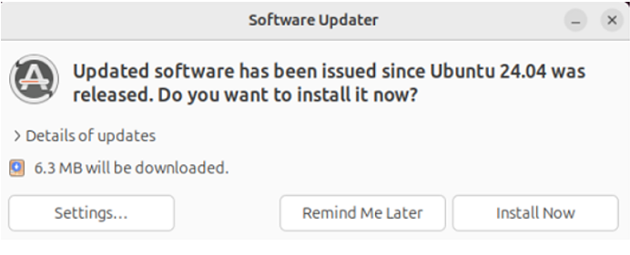

### Install Packages and User Config
- If during this section you see the following error, 
    - Log out and log back into VM and try again
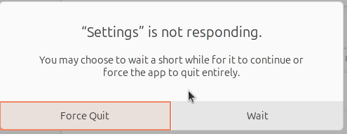
- Enable RDP
    - Click on Network/Sound/Power in upper right corner of screen
    - Click on Gear
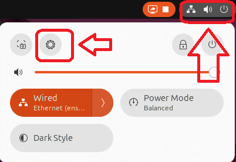
    - Scroll down on left side to "System" click on it
    - Click on "Remote Desktop"
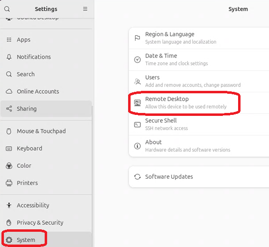
    - Enable "Desktop Sharing" and "Remote Control"
    - Click on Password's "eyeball" and change Password to "password"
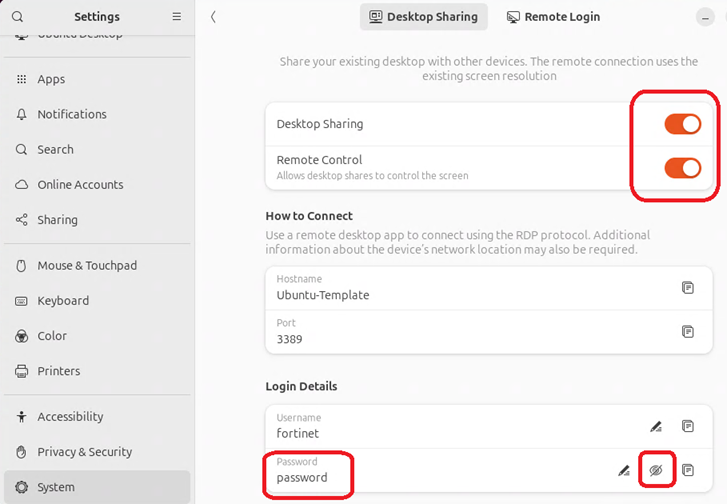

- Find IP address of VM here:
    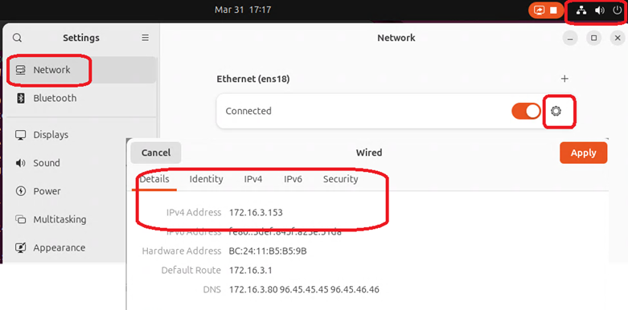

- From your laptop/desktop connect to the VM via RDP
- Start Terminal
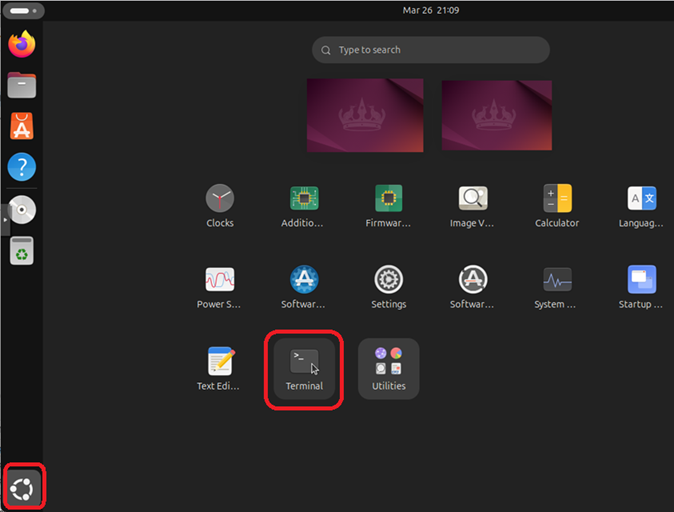

{}
~~~~bash
sudo apt install git -y
git clone https://github.com/stevesweeneywisc/SE-Lab-Ubuntu-Template /home/fortinet/Downloads
cd /home/fortinet/Downloads/
chmod 755 *.sh
./Ubuntu_Base_Install.sh
~~~~
{}
- System will reboot after script runs
- Login user/password "fortinet/password"
- Remove keyring password
    - **Note:** This is not a secure way to setup Ubuntu.  However, it is done for ease of use in Lab environment.  If you don’t do this, the RDP password WILL change to a random string after every reboot
    - {}While this should never be done in production, this being done in this non-internet facing lab, for simplicity and to reduce complexity.{}
    - Open Utilities folder
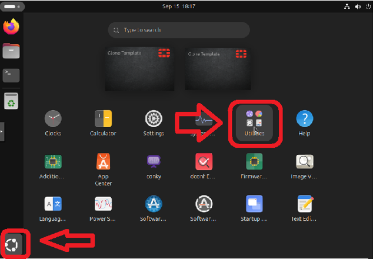
    - Open “Passwords and Keys”
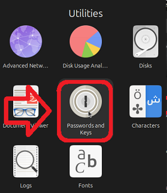
    - Right Click on Login, and choose Change Password
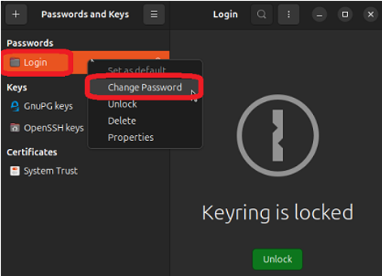
    - Enter the old password: "password"
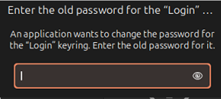
    - Leave new password blank for both and click “Continue”
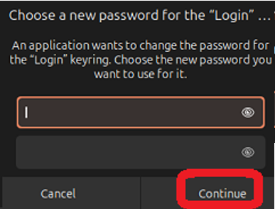
    - Store passwords unencrypted? Click Continue
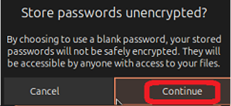
    - Close "Passwords and Keys" window
- Configure user “fortinet” for “Automatic Login”
    - Click on Network/Sound/Power in upper right corner of screen
    - Click on Gear

    - Scroll down on left side to "System" click on it
    - Click on "Users"
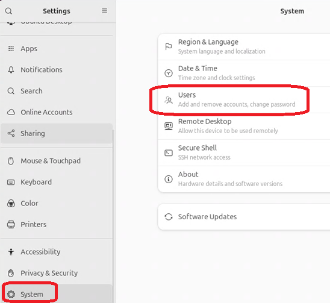
    - Click on "Unlock"
    - Enable "Automatic Login"
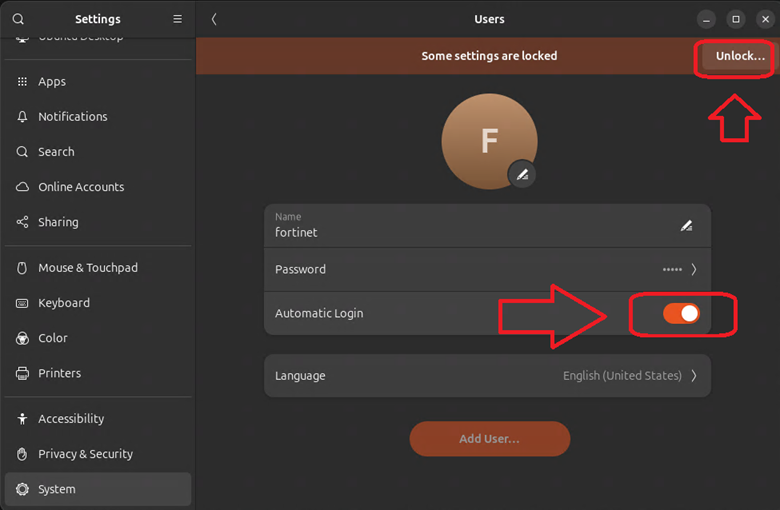
    - Close the Settings Window

### Verify Configuration and Prep Cloud-Init
- Reboot and verify auto login
- RDP to VM
{}
~~~~bash
sudo cloud-init clean -–machine-id
sudo shutdown now
~~~~
{}
### Convert VM to Template
 - In PVE GUI  
    - Datacenter > Node > VM (one just created) >  Cloud-Init > Edit
    - Remove IP Address and Gateway
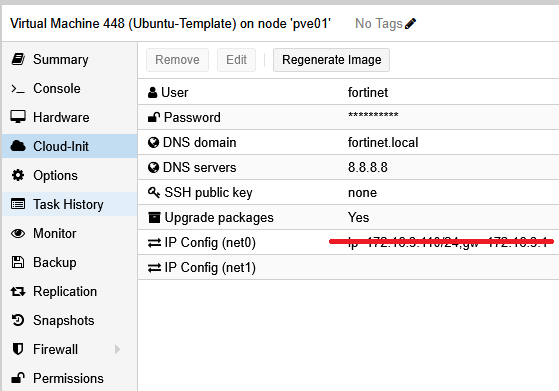
    - Datacenter > Node > Right Click on VM (one just created) > Convert to template
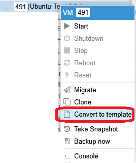

### Complete

